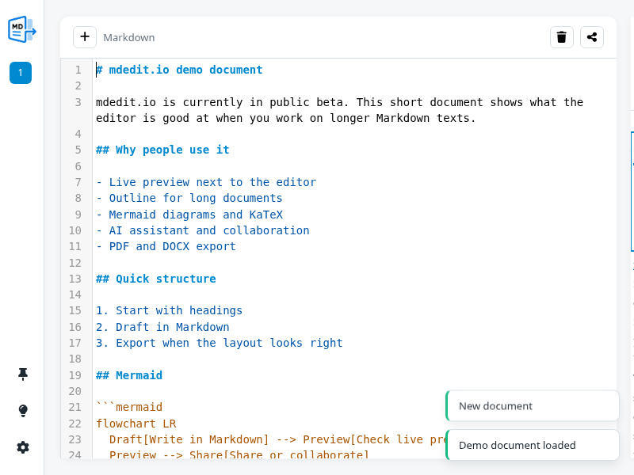

# mdedit.io

<p align="center">
   
</p>

mdedit.io is a browser-based Markdown editor for long-form writing, structured documents, and shareable drafts.

It combines live preview, document outline, collaboration, AI-assisted editing, printable layout controls, and export to Markdown, DOCX, and PDF in one self-hosted app.

> Write in Markdown, keep structure visible, share only when you decide to, and export when the draft is ready.



## Public Beta

- Status: active public beta
- Best for: notes, articles, handouts, technical drafts, and shareable working documents
- Deployment model: self-hosted web application, not an npm package

Try the local app after startup at `http://localhost:3210`.

## How It Feels

mdedit.io is built for the gap between a plain text editor and a full publishing system.

You write in Markdown, keep a live preview next to the source, move through long documents via the outline, adjust print layout when the document starts to matter, and share a permalink only when you want the draft to leave the current session.

The app is especially useful when a document starts simple but grows into something structured enough to need headings, export paths, review, or collaboration.

## Why mdedit.io?

- Write and preview Markdown side by side
- Navigate long documents through a heading-based outline
- Share documents explicitly via permalink instead of making everything public by default
- Collaborate in the browser with built-in collab features
- Use AI assistance for editing and document work
- Export working drafts to Markdown, DOCX, and PDF

## Try These Paths

- Open the example document in [docs/examples/example.md](docs/examples/example.md)
- Start locally with Docker and open `http://localhost:3210`
- Test sharing deliberately instead of publishing everything by default
- Run `npm run release:check` before a public rollout

## Feedback

Feedback, bug reports, and product suggestions are welcome through the repository issue tracker.

The repo includes dedicated issue forms for bug reports, product feedback, and general questions to keep reports actionable.

For contribution workflow and local validation, see [CONTRIBUTING.md](CONTRIBUTING.md). For the current security posture and remaining hardening work, see [docs/operations/SECURITY.md](docs/operations/SECURITY.md).

If you want a quick walkthrough of the feature surface, start with the example document in [docs/examples/example.md](docs/examples/example.md).

## Documentation

- Operations and deployment docs: `docs/operations/`
- Architecture and engineering notes: `docs/engineering/`
- Product and feature concepts: `docs/concepts/`
- Examples and test material: `docs/examples/`, `docs/testing/`

You can find an overview in [docs/README.md](docs/README.md).

## Repository Scope

This repository contains the mdedit.io application itself.

- `package.json` uses `"private": true` to prevent accidental publication to the npm registry
- the source is open and licensed under Apache 2.0, except for brand assets and trademarks noted below
- browser dependencies are bundled locally for the active runtime path

## Getting Started

### Prerequisites

- Node.js 20 or newer for local development, release checks, and `deploy-prod.sh`
- Docker and Docker Compose for the recommended runtime path
- Pandoc/LaTeX only for certain export paths outside the container

The browser runtime is loaded from locally bundled assets in `public/vendor/` and `public/vendor/npm/`. The active app path does not depend on external browser CDNs.

### Option 1: Docker (recommended)

```bash
# Start the containers
docker compose up -d

# Check status
docker compose ps

# Show logs
docker compose logs -f

# Or use the management script
./docker.sh start
./docker.sh logs
```

The app is available locally at `http://localhost:3210`.

See [docs/operations/DOCKER.md](docs/operations/DOCKER.md) for details.

**Security note for production:**

Before deploying to production, you **MUST** set a secure cookie secret:

```bash
# Create a .env file (based on .env.example)
cp .env.example .env

# Generate a secure secret
openssl rand -hex 32

# Add it to .env:
COOKIE_SECRET=your_generated_secret_here
```

For Docker Compose:

```bash
# Set the environment variable
export COOKIE_SECRET=$(openssl rand -hex 32)
docker compose up -d
```

Before public releases or production deployments, the release gate should always pass successfully:

```bash
npm run release:check
```

### Option 2: Direct Node.js start

1. Install dependencies:
   - `npm install`
2. Install Pandoc and LaTeX (for PDF export):
   ```bash
   # Ubuntu/Debian
   sudo apt-get install pandoc texlive-xetex texlive-latex-recommended librsvg2-bin
   ```
3. Start the server:
   - `npm run dev`
4. The app runs at `http://localhost:3210`.

Note: `npm run release:check` and `./deploy-prod.sh` require local Node 20+. If your host intentionally stays older, use the Docker path for production-like test runs.

## Nginx Reverse Proxy (example)

Point both domains to the same server:

```nginx
server {
  listen 80;
  server_name mdedit.io www.mdedit.io;

  location / {
    proxy_pass http://127.0.0.1:3210;
    proxy_set_header Host $host;
    proxy_set_header X-Real-IP $remote_addr;
    proxy_set_header X-Forwarded-For $proxy_add_x_forwarded_for;
    proxy_set_header X-Forwarded-Proto $scheme;
  }
}
```

## Notes

- Session-based via HttpOnly cookie (`sid`)
- History is kept per session, no login required
- Tree view is based exclusively on headings (H1-H6)

## Security & Features

### Implemented security measures

- ✅ **Rate limiting**: 100 requests/minute per IP
- ✅ **Security headers**: CSP, HSTS, X-Frame-Options (via Helmet)
- ✅ **Secure cookies**: HttpOnly, SameSite=Lax, Secure in production
- ✅ **Input validation**: Markdown size limit (1 MB), SQL injection protection
- ✅ **Privacy**: Pastes are private by default (session-bound)
- ✅ **Temp file cleanup**: Automatic cleanup after export
- ✅ **Self-hosted frontend runtime**: Browser dependencies are served locally instead of being loaded from external CDNs at runtime

### Sharing & Privacy

Pastes are **private** by default and only visible within the current session. To share a paste:

```javascript
// POST /api/pastes/:id/share
{ "shared": true } // Makes the paste public via permalink
```

Only pastes explicitly marked as `shared: true` are visible to other users via permalink.

### Maintenance & Cleanup

Old sessions (>30 days inactive) should be cleaned up regularly:

```bash
# Manual
node cleanup.js

# Via cron (daily at 3:00 AM)
0 3 * * * cd /path/to/app && node cleanup.js >> /var/log/md-cleanup.log 2>&1
```

The cleanup script removes:
- Sessions with no activity for 30 days
- Orphaned pastes (whose session was deleted)
- Runs VACUUM for database optimization

## License

The source code of mdedit.io is licensed under the Apache License 2.0.

Copyright 2026 Matthias Hertel.

See `LICENSE` and `NOTICE` for details.

Documentation and website content are licensed under Creative Commons Attribution 4.0 International unless otherwise noted.

The names `mdedit`, `mdedit.io`, the domain, logos, icons and other brand assets are not licensed under the Apache License 2.0. See `TRADEMARKS.md`.

## Attribution

mdedit.io was originally created by Matthias Hertel.

When redistributing this software, please retain the copyright notice, license text and NOTICE file as required by the Apache License 2.0.
