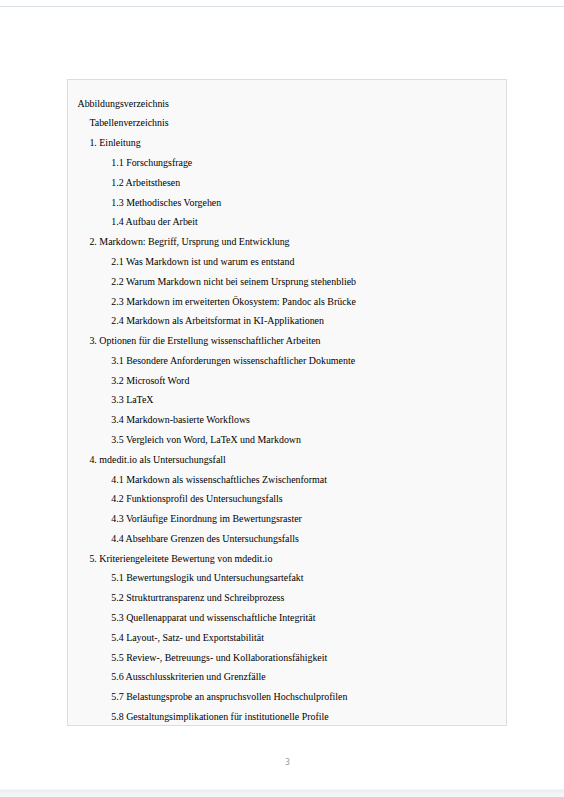

# mdedit.io

<p align="center">
   
</p>

**mdedit.io is a no-account Markdown editor for serious documents.**

Write in Markdown, navigate long documents via outline, collaborate in the browser, and export print-ready PDF or review-ready DOCX for supervisor feedback — without Word, LaTeX, or a desktop app.

> **[→ Try it now at mdedit.io](https://mdedit.io)**

---

### What the output looks like



**[→ Download sample PDF output](docs/examples/example-output.pdf)**

For thesis and review workflows, the same Markdown source can also become a review-ready DOCX for Word comments and tracked changes.

---

### The editor


## Public Beta

- Status: active public beta
- Best for: **thesis drafts, technical specs, concept papers, structured reports**
- Deployment model: self-hosted web application, not an npm package

Try the live app at **[mdedit.io](https://mdedit.io)** — no account required.  
Or run it locally after startup at `http://localhost:3210`.

## Features

- **No account required** — open the editor, start writing
- **Live preview** side by side with the Markdown source
- **Outline / tree navigation** for long structured documents
- **Print-ready PDF export** with page layout controls
- **DOCX export** for review-ready Word handoff and supervisor feedback
- **Mermaid diagrams** and **KaTeX math** rendered inline
- **Citations** via BibTeX / CSL with automatic reference lists
- **Thesis workflow**: draft in Markdown, review in DOCX, submit as PDF
- **AI assistance** for editing and document work (bring your own key)
- **Lightweight collaboration** — share a permalink, edit together
- **Self-hostable** with Docker, Apache 2.0 license

## Getting Started

**No installation needed** — try the live app at **[mdedit.io](https://mdedit.io)** directly in your browser.

To run it locally:

### Prerequisites

- Node.js 20 or newer for local development and `deploy-prod.sh`
- Docker and Docker Compose for the recommended runtime path

The browser runtime is loaded from locally bundled assets in `public/vendor/` and `public/vendor/npm/`. The active app path does not depend on external browser CDNs.

### Option 1: Docker (recommended)

```bash
# Start the containers
docker compose up -d

# Check status
docker compose ps

# Show logs
docker compose logs -f

# Or use the management script
./docker.sh start
./docker.sh logs
```

The app is available locally at `http://localhost:3210`.

See [docs/operations/DOCKER.md](docs/operations/DOCKER.md) for details.

Before deploying to production, you **MUST** set a secure cookie secret:

```bash
# Create a .env file (based on .env.example)
cp .env.example .env

# Generate a secure secret
openssl rand -hex 32

# Add it to .env:
COOKIE_SECRET=your_generated_secret_here
```

For Docker Compose:

```bash
# Set the environment variable
export COOKIE_SECRET=$(openssl rand -hex 32)
docker compose up -d
```

Before public releases or production deployments, the release gate should always pass successfully:

```bash
npm run release:check
```

If you want the internal `/stats` page to show backlink, query, and search-position snapshots, normalize a JSON export into the canonical format first:

```bash
npm run stats:marketing-snapshot -- --input docs/examples/marketing-stats.example.json
```

By default this writes to `MARKETING_STATS_FILE` when set, otherwise to `DATA_DIR/marketing-stats.json` when `DATA_DIR` is configured in `.env`, and otherwise falls back to `data/marketing-stats.json`. That keeps the documented npm flow aligned with the `/stats` lookup path. You can still override the source label or target path with `--source` and `--output`.

### Option 2: Direct Node.js start

1. Install dependencies:
   - `npm install`
2. Install Pandoc and LaTeX (for PDF export):
   ```bash
   # Ubuntu/Debian
   sudo apt-get install pandoc texlive-xetex texlive-latex-recommended librsvg2-bin
   ```
3. Start the server:
   - `npm run dev`
4. The app runs at `http://localhost:3210`.

Note: `npm run release:check` and `./deploy-prod.sh` require local Node 20+. If your host intentionally stays older, use the Docker path for production-like test runs.

## Feedback & Contributing

Feedback, bug reports, and feature suggestions are welcome through the [issue tracker](https://github.com/MatthiasHertel21/mdedit/issues).

For contribution workflow and local validation, see [CONTRIBUTING.md](CONTRIBUTING.md).  
For security posture and remaining hardening work, see [docs/operations/SECURITY.md](docs/operations/SECURITY.md).

## Documentation

- [Docker Setup](docs/operations/DOCKER.md)
- [AI API Configuration](docs/operations/AI-API.md)
- [Security Notes](docs/operations/SECURITY.md)
- [Example documents](docs/examples/)

## Nginx Reverse Proxy (example)

Point both domains to the same server:

```nginx
server {
   listen 80;
   server_name mdedit.io www.mdedit.io;
   client_max_body_size 16m;

  location / {
    proxy_pass http://127.0.0.1:3210;
    proxy_set_header Host $host;
    proxy_set_header X-Real-IP $remote_addr;
    proxy_set_header X-Forwarded-For $proxy_add_x_forwarded_for;
    proxy_set_header X-Forwarded-Proto $scheme;
  }
}
```

Set `client_max_body_size` to at least `16m` when PDF export should accept full paged-preview payloads through nginx.

## Notes

- Session-based via HttpOnly cookie (`sid`)
- History is kept per session, no login required
- Tree view is based exclusively on headings (H1-H6)

## Security & Features

### Implemented security measures

- ✅ **Rate limiting**: 100 requests/minute per IP
- ✅ **Security headers**: CSP, HSTS, X-Frame-Options (via Helmet)
- ✅ **Secure cookies**: HttpOnly, SameSite=Lax, Secure in production
- ✅ **Input validation**: Markdown size limit (1 MB), SQL injection protection
- ✅ **Privacy**: Pastes are private by default (session-bound)
- ✅ **Temp file cleanup**: Automatic cleanup after export
- ✅ **Self-hosted frontend runtime**: Browser dependencies are served locally instead of being loaded from external CDNs at runtime

### Sharing & Privacy

Pastes are **private** by default and only visible within the current session. To share a paste:

```javascript
// POST /api/pastes/:id/share
{ "shared": true } // Makes the paste public via permalink
```

Only pastes explicitly marked as `shared: true` are visible to other users via permalink.

### Maintenance & Cleanup

Old sessions (>30 days inactive) should be cleaned up regularly:

```bash
# Manual
node cleanup.js

# Via cron (daily at 3:00 AM)
0 3 * * * cd /path/to/app && node cleanup.js >> /var/log/md-cleanup.log 2>&1
```

The cleanup script removes:
- Sessions with no activity for 30 days
- Orphaned pastes (whose session was deleted)
- Runs VACUUM for database optimization

## License

The source code of mdedit.io is licensed under the Apache License 2.0.

Copyright 2026 Matthias Hertel.

See `LICENSE` and `NOTICE` for details.

Documentation and website content are licensed under Creative Commons Attribution 4.0 International unless otherwise noted.

The names `mdedit`, `mdedit.io`, the domain, logos, icons and other brand assets are not licensed under the Apache License 2.0. See `TRADEMARKS.md`.

## Attribution

mdedit.io was originally created by Matthias Hertel.

When redistributing this software, please retain the copyright notice, license text and NOTICE file as required by the Apache License 2.0.
