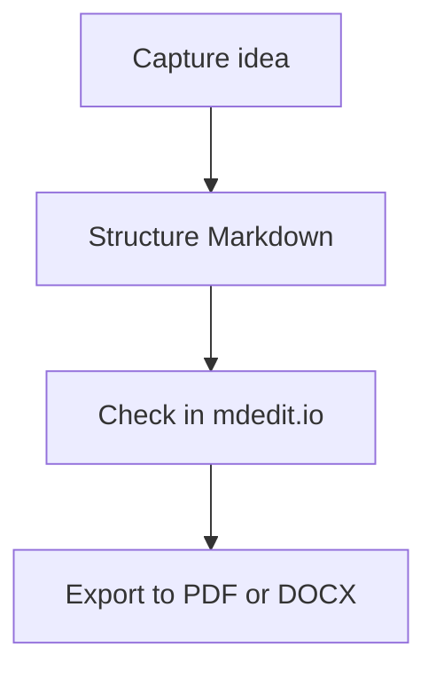
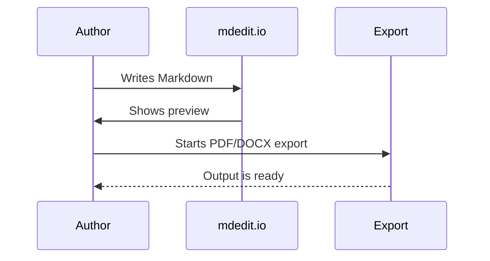

```mdedit-bibliography
[{"URL":"https://daringfireball.net/projects/markdown/","author":[{"family":"Gruber","given":"John"}],"id":"gruber2004markdown","issued":{"date-parts":[[2004]]},"note":"Accessed 2026-05-10","title":"Markdown","type":""},{"URL":"https://commonmark.org/","author":[{"literal":"CommonMark Contributors"}],"id":"commonmark2026","issued":{"date-parts":[[2026]]},"note":"Accessed 2026-05-10","title":"CommonMark","type":""},{"URL":"https://pandoc.org/","author":[{"family":"MacFarlane","given":"John"}],"id":"pandoc2025","issued":{"date-parts":[[2025]]},"note":"Accessed 2026-05-10","title":"Pandoc","type":""},{"author":[{"family":"Hertel","given":"Matthias"}],"id":"mdeditreadme2026","issued":{"date-parts":[[2026]]},"note":"Repository documentation, local source","title":"mdedit.io README","type":""},{"author":[{"family":"Hertel","given":"Matthias"}],"id":"mdedithelp2026","issued":{"date-parts":[[2026]]},"note":"Repository help page, local source","title":"mdedit.io Help Page","type":""},{"author":[{"family":"Hertel","given":"Matthias"}],"id":"mdeditaiapi2026","issued":{"date-parts":[[2026]]},"note":"Repository operations documentation, local source","title":"mdedit.io AI Chat API Documentation","type":""},{"author":[{"family":"Hertel","given":"Matthias"}],"id":"mdeditserver2026","issued":{"date-parts":[[2026]]},"note":"Repository implementation in server.js, local source","title":"mdedit.io Scientific Citation and Export Implementation","type":""}]
```

::: title-page
<!-- img: align=center width=44% -->


# Markdown made practical with mdedit.io {.no-toc}

## A practical book for writing, layout, collaboration, and PDF export {.no-toc}

**mdedit.io Editorial Team**  
Updated 2026-05-10
:::

::: blank-page

# How to use this book

This book is meant to be an actual working guide. It explains not only Markdown syntax, but the full workflow that mdedit.io currently supports: writing, structuring, checking pages, revising together, and exporting to PDF or DOCX at the end. If you are opening the app for the first time, this document should carry you all the way to a stable result.

**The learning path is organized like this:**

1. First you understand mdedit.io's document model: one Markdown core, multiple views, and a clear export path.
2. Then you learn the syntax and extensions that matter in everyday work.
3. The second half adds navigation, page view, collaboration, AI support, layout, and scientific document features.
4. At the end you work with complete workflows instead of isolated tricks.

**If you only have 30 minutes:** read Chapter 1, Chapter 2, Chapter 5, and Chapter 7. That is enough to write cleanly, orient yourself in the editor, share a document, and produce a first PDF or DOCX export.

<!-- page-break -->

# Chapter plan

1. Chapter 1 explains how mdedit.io works as a document environment and why that matters for long texts.
2. Chapter 2 shows the syntax you need immediately.
3. Chapter 3 extends the base model with structure markers, indexes, IDs, and cross-references.
4. Chapter 4 covers formulas, diagrams, images, tables, and page-building elements.
5. Chapter 5 describes navigation, sharing, and collaboration in the current product.
6. Chapter 6 brings together layout, AI, embedded bibliography, and export.
7. Chapter 7 walks through complete workflows for real documents.
8. The appendix remains a compact reference in book form.

<!-- page-break -->

::: chapter

# 1. mdedit.io as a document environment

**What you learn here:**

- why mdedit.io is not just an editor but a complete document path,
- how editor, preview, tree view, page view, and AI fit together,
- why Markdown is the working format here rather than just an input format.

**Mini task:** Open a new document in mdedit.io and deliberately switch once between editor, preview, tree view, page view, and the AI panel. The goal is not writing yet, but understanding the work surfaces.

mdedit.io is now aimed at serious documents: theses, technical specifications, reports, manuals, and book manuscripts. The core remains Markdown, but the product around it has become broader. There is a sidebar with history and folders, a right-side workspace with preview, tree view, page view, and AI chat, a layout editor for page and typography rules, a sharing path for links and collaborative editing, and PDF and DOCX export from the same source [@mdeditreadme2026; @mdedithelp2026].

For beginners this is an advantage because the app does not force an account while still covering the main stages of professional document work. You start in raw text, control structure through headings, check reading flow in preview, inspect page breaks in page view, and only then decide about sharing, collaboration, or export. That is exactly what keeps the document core understandable and portable [@gruber2004markdown; @pandoc2025].

Table 1: The five work surfaces in mdedit.io and their role in daily work.

::: table{layout=scientific}
| Area | What you do there | What it is especially good for | Important note |
| --- | --- | --- | --- |
| Editor | Write Markdown directly | Fast drafting and rearranging | The editor is the source, not the preview |
| Preview | Read the rendered document | Instantly checking syntax visually | It is not yet identical to final page output |
| Tree view | See H1 to H6 as structure | Navigating large documents | The tree reads headings, not hidden semantics |
| Page view | See paged preview with breaks | Print- and PDF-near checking | Only here do page breaks become realistic |
| AI panel | Work with document context | Rephrasing, tightening, rearranging | Responsibility for facts and sources stays with you |
:::

### 1.1 The core principle in one sentence

An mdedit document is a readable Markdown text that can simultaneously feed preview, page layout, collaboration, AI editing, and export.

### 1.2 The four presets

mdedit.io offers four preview presets: Scientific, Compact, Literary, and Document. Scientific fits theses and reports with a calm page texture. Compact is useful for reference material and dense overviews. Literary gives long reading texts more air. Document uses layout rules directly from your Markdown and therefore becomes the most precise mode once you start adding document-local styling rules [@mdedithelp2026].

This book uses `preset: literary` because it should read like an extended guide. The same system can switch to a more scientific or compact mode at any time without rewriting the text.

::: pagebreak

# 2. The syntax you need right away

**What you learn here:**

- how headings and paragraphs form the core of a document,
- which characters and patterns matter first in everyday work,
- how a clean manuscript already emerges from a few building blocks.

**Mini task:** Create a tiny document with one H1, two H2 headings, and one paragraph under each.

## 2.1 Headings and paragraphs

The most important starting point is chapter structure. Markdown creates headings with leading `#` characters. A blank line separates one thought from the next.

```md
# Chapter
## Subchapter
### Section

A new paragraph begins after a blank line.
```

### 2.1.1 What good structure means

Good Markdown texts think top-down. First comes the outline, then the wording. That is exactly why mdedit.io works so well for outline-oriented writing: the tree view builds directly on your headings, and every clean H1, H2, or H3 structure later pays off in navigation, the table of contents, and export [@mdedithelp2026; @mdeditreadme2026].

## 2.2 Emphasis, code, and quotations

The most important symbols for emphasis are easy to learn.

```md
**bold**
*italic*
`inline-code`
> Quote
```

In running text that becomes **clear**, *emphasized*, and `precise`. A block quote is useful when you want to set off a borrowed idea, a definition, or a short reminder.

> Markdown is strongest where structure matters more than permanent visible formatting.

## 2.3 Lists, links, images, and tables

Lists organize arguments, links point to sources, images anchor attention, and tables condense differences.

```md
- Item A
- Item B

1. Step one
2. Step two

[mdedit.io](https://md.2b6.de)


| Column | Value |
| --- | --- |
| A | B |
```

- Unordered lists are good for collections.
- Ordered lists are good for processes.
- Long list items remain readable across multiple lines if indentation stays clean.

1. Write first.
2. Structure next.
3. Export after that.

<!-- img: align=center width=74% frame -->


Table 2: The first syntax building blocks in everyday work.

::: table{layout=compact}
| Building block | What you need it for | Rule of thumb |
| --- | --- | --- |
| `#` | Headings | Structure first |
| `**...**` | Emphasis | Make only the important parts bold |
| `-` or `1.` | Lists | Order ideas cleanly |
| `` `...` `` | Code or terms | Mark technical content clearly |
| `![...]` | Images | Make content visible |
:::

The table is intentionally short. Beginners often overestimate how much Markdown they need, even though the first productive documents already work with headings, paragraphs, lists, links, images, and two or three emphasis patterns. Everything else can be added once the text itself is carrying its weight.

<div class="page-break" style="break-before: page; page-break-before: always;"></div>

# 3. Structure markers and useful extensions

**What you learn here:**

- which extensions are actually useful in daily work,
- how IDs, cross-references, and indexes fit together in mdedit.io,
- where extra syntax helps and where it only creates noise.

**Mini task:** Add exactly one footnote, one inline mark, and one two-item task list to an existing paragraph.

Standard Markdown already goes far. In practice, though, a few extensions help make a document not only correct but comfortable to work with.

## 3.1 GFM: task lists, autolinks, and strikethrough

```md
- [x] Done
- [ ] Open

https://example.com

~~outdated~~
```

- [x] Chapter structure drafted
- [ ] Final export checked

Autolink in text: https://example.com

This word is ~~outdated~~ and will be replaced.

## 3.2 Footnotes and definition lists

Footnotes are useful when an extra note should not break reading flow.[^beginner]

Term Markdown
: A lightly marked-up language for structured text.

Term Preview
: The rendered view of the same Markdown source.

[^beginner]: In mdedit.io, footnotes are especially useful for comments, extra hints, and variants as long as no highly specialized note-style citation path is required.

## 3.3 Admonitions, marks, and small helpers

::: warning
Too much formatting also makes Markdown documents worse. If every second line is bold, colored, or boxed, the structure loses its calm.
:::

::: tip
Memorize only five things first: headings, paragraphs, lists, links, and images. Everything else can come later.
:::

Inline helpers work as well:

- Emoji: I :heart: clear documents.
- Subscript and superscript: H~2~O and x^2^.
- Marking: ==This sentence should stand out during skimming==.
- Typographic quotes: "straight" becomes “typographic”.

*[API]: Application Programming Interface

An abbreviation such as API can be explained once in the document without repeating the same explanation in every later sentence.

## 3.4 IDs, table of contents, and cross-references

### A section with an ID {#anchor-section}

An ID is useful when you want to refer to a specific spot in the document or when mdedit.io later uses semantic cross-references. For structured texts this becomes especially valuable because the table of contents, section references, and scientific references then all attach to the same outline, not just to visual labels.

```md
### A section with an ID {#anchor-section}

A paragraph with a class {.note}
```

For longer documents, three markers show up all the time:

```md
[[toc]]

<!-- list-of-figures -->
<!-- list-of-tables -->
```

`[[toc]]` creates a table of contents. The list-of-figures and list-of-tables markers reserve space for automatically generated indexes. That is exactly why it pays to name headings, images, and tables properly from the beginning.

For internal section references, mdedit.io works with typed IDs such as `#sec:...` and text references such as `[@sec:methodik]`. Preview resolves these to clickable section numbers, and export preserves the same semantic path [@mdedithelp2026; @mdeditserver2026].

<!-- page-break -->

# 4. Math, diagrams, and visual elements

**What you learn here:**

- how mathematical formulas remain readable inside the document,
- how Mermaid turns text into diagrams,
- how images become more than decoration on the page.

**Mini task:** Add one mini-diagram or one formula to a test document and check the preview immediately.

Markdown is often underestimated as soon as math or visualization enters the picture. With KaTeX and Mermaid, however, mdedit.io handles these cases directly in the document.

## 4.1 Formulas with KaTeX

Inline math uses `$...$`, larger blocks use `$$...$$`.

Inline: $E = mc^2$

$$
\int_0^\infty e^{-x^2} \, dx = \frac{\sqrt{\pi}}{2}
$$

## 4.2 Diagrams with Mermaid





## 4.3 Image markers and text wrap

mdedit.io supports prefixed image markers that control alignment, width, and framing directly from Markdown.

```md
<!-- img: align=right width=28% shadow -->


```

<!-- img: align=right width=28% shadow -->


This paragraph demonstrates the actual effect: the image does not merely sit below the text but can accompany it as a calm side figure. That matters for books, manuals, and reports because text and visual orientation move closer together. Markers such as `frame`, `shadow`, or `filter=grayscale` make it possible to reuse the same image file in different roles.

A second paragraph ensures that text wrap becomes clearly visible and then ends cleanly again. In longer documents this kind of detail often decides whether a page feels like a manual or like a random export stream.

## 4.4 Tables, columns, and page elements

Markdown alone is not yet a full book-layout system. That is why mdedit.io adds table layouts, columns, and explicit page markers. For tables you can choose different layouts such as `scientific` or `compact`. For cheat sheets, comparisons, or appendix pages there are column blocks and break markers.

```md
::: table{layout=scientific}
| Field | Value |
| --- | --- |
| Style | calm |
:::

::: columns{count=2 gap=18pt rule=true}
Left column

::: column-break

Right column
:::
```

On top of that come chapter and page markers such as `::: chapter`, `::: pagebreak`, `<!-- page-break -->`, or `<!-- title-page --> ... <!-- /title-page -->`. They matter most once you no longer just want to read a document but deliberately control it as a page object [@mdedithelp2026].

::: section{type=new-page columns=2}
## 4.5 Two-column PDF reference section

The left column serves as a real layout specimen. It shows what happens when a new section triggers both a new page and a two-column layout during export, without requiring a separate document. That is relevant for appendices, side notes, cheat sheets, and dense comparison pages.

<!-- column-break -->

The right column tests the same case after an explicit column break. This means the reference file does not merely use a general columns container, but also a section instruction that combines page breaks and multi-column layout. For PDF testing that is a valuable special case.
:::

::: chapter

# 5. Navigation, sharing, and collaboration

**What you learn here:**

- how to move safely through long documents,
- how sharing and collaborative editing work today,
- which product features save the most time in practice.

**Mini task:** Create a folder, move two documents into it, and then deliberately open the share menu. The goal is to learn the product logic beyond the text itself.

This is the point where mdedit.io most clearly differs from a plain Markdown field. For short notes all of this may already feel luxurious. For long texts it is the difference between a file and a working environment.

## 5.1 Sidebar, history, and tree view

The sidebar manages document history and folders. You can group documents, filter them through search, rename folders, export collections, and delete items. For series of reports, chapters, or variants this saves noticeable time because document organization no longer has to live outside the editor [@mdedithelp2026].

The tree view sits to the right of preview. It can visualize structure either as an outline or as a graph, but it consistently works from your headings H1 to H6. That is both a strength and a limit: for chapter navigation it is excellent, but it does not replace deeper document semantics for objects that are not modeled as headings at all [@mdeditreadme2026; @mdedithelp2026].

## 5.2 Share menu and export paths

Today multiple paths come together in the share menu at the top of the editor: shareable links, copying Markdown or formatted Word text, downloading as Markdown, DOCX, or PDF, and ZIP export for folders or local data including assets. That is what makes mdedit.io interesting for review and submission processes: the same document core can move directly into several output forms [@mdedithelp2026; @mdeditserver2026].

The logic of visibility matters: documents are not simply public by default. They become visible only through the sharing path. That is sensible for working drafts because private creation and deliberate sharing remain clearly separate [@mdeditreadme2026].

Table 3: The most important product functions beyond plain writing.

::: table{layout=scientific}
| Function | What it currently does | Why it matters in practice |
| --- | --- | --- |
| History and folders | collect, group, and filter documents | Keep text series and versions organized |
| Tree view | show structure as outline or graph | Check macro-structure of large texts faster |
| Share menu | bundle link, copy, download, and ZIP | Simplify review, handoff, and archiving |
| Collaborative editing | show presence and live work in shared docs | Coordinate without file ping-pong |
| Page view | show print-near paged preview | Detect export issues earlier |
:::

## 5.3 Collaborative editing

Shared documents can be edited together. Presence indicators are visible in the interface, the display name for collaboration is set in the settings, and a password can be added to shared documents. The option `Allow collaboration` controls whether a client automatically participates in shared documents [@mdedithelp2026].

In practice one point matters: sharing and collaboration are connected but separate steps. First the link exists, then collaborative editing begins. For teams, supervisors, or quick review rounds this is much clearer than an uncontrolled model where everything is always live for everyone.

The practical rule is simple: share the document first, then collaborate intentionally. That keeps ownership, visibility, and responsibility clearly separated.

::: pagebreak

# 6. Layout, AI, bibliography, and export

**What you learn here:**

- how layout in mdedit.io is split across presets, the layout editor, and the document block,
- how the current bibliography path actually works,
- how AI editing and export connect today.

**Mini task:** Add a small frontmatter block with `title`, `lang`, and `preset` to a test document before trying additional options.

## 6.1 Frontmatter and metadata

YAML frontmatter sits at the beginning of a document and bundles language, title, authorship, and further document options. In mdedit.io, frontmatter can also mark the scientific path, the reference section, or the base preset of a document [@mdeditserver2026].

```yaml
---
title: "My document"
lang: en-US
preset: literary
---
```

For longer or more technical documents, additional keys enter the picture, such as `number-sections: true` for numbered sections or `reference-section-title` for the bibliography heading. This moves layout and document logic out of scattered tricks and into one clearly visible opening block.

## 6.2 Citations and embedded bibliography

For scientific documents, mdedit.io supports the embedded source mode through an `mdedit-bibliography` block. This is the authoritative local document path today. Citations then remain data-based inside the document instead of drifting around as manually formatted reference lists [@pandoc2025; @mdeditserver2026].

```text
---
citation-source: embedded
reference-section-title: References
link-citations: true
link-bibliography: true
---

Following [@gruber2004markdown] and [@pandoc2025] ...

~~~mdedit-bibliography
[{"id":"gruber2004markdown", "title":"Markdown", ... }]
~~~

#refs
```

This reference file actually uses that mechanism. That is why statements about Markdown, CommonMark, Pandoc, and mdedit.io can be cited directly in running text [@gruber2004markdown; @commonmark2026; @mdeditreadme2026]. Older file-based `bibliography:` paths are no longer the intended standard workflow for local mdedit documents [@mdeditserver2026].

## 6.3 The AI panel and structured edit actions

The AI panel in mdedit.io does not act only as a free-form chat. It can also trigger structured operations such as `REPLACE`, `INSERT`, `APPEND`, `PREPEND`, `UPDATE_LAYOUT`, or `ADVICE` [@mdeditaiapi2026; @mdeditserver2026]. For beginners this is useful whenever a chapter should be shortened, a section reordered, or a list consolidated without losing document structure.

For layout requests, `UPDATE_LAYOUT` is especially important. If you ask for wider margins, a header, changed columns, or different typography, the assistant does not need to rewrite the whole text; it can update the `layout` block directly. That is one of the most productive differences between plain text editing and document-aware AI support.

mdedit.io also manages multiple chats per document. Models and API connections are configured in settings under AI models, and AI changes can be undone [@mdedithelp2026].

::: info
The best role for AI in Markdown documents is editorial: smoothing, rearranging, summarizing, and proposing variants. Responsibility for facts, sources, and arguments remains human.
:::

## 6.4 Layout editor, page view, and export

mdedit.io does not separate writing from a last-minute panic export. Normal preview shows the content, page view shows the page, and export moves the same core into DOCX or PDF [@mdedithelp2026; @mdeditserver2026]. For books, reports, and scientific texts this matters because margins, chapter openings, image captions, and tables do not become visible only at the last minute.

The layout editor extends this path with a visual interface for margins, typography, tables, and visual rules. Where presets are not enough, a document can additionally carry a `layout` block. That three-step model is typical for mdedit.io today: preset for a fast start, layout editor for targeted adjustments, and `layout` block for document-bound fine-tuning.

::: table{layout=reference}
| Layout option | Visible PDF effect |
| --- | --- |
| custom caption position | table captions remain distinguishable from the default |
| zebra striping | dense tables stay easier to read in long PDFs |
| finer borders | reference pages stay technical but calmer |
:::

<div class="page-break" style="break-before: page; page-break-before: always;"></div>

# 7. Three reliable workflows

**What you learn here:**

- how mdedit.io is used in real document situations,
- when to use structure, preview, page view, and collaboration in which order,
- how to run a realistic final check before export.

**Mini task:** Take an existing document and assign it to one of the following three patterns: solo draft, collaborative review, or output-oriented long document.

If you work with mdedit.io, you need less trick knowledge than ordering discipline. These three patterns cover most real use.

1. **Solo draft:** Build structure in the editor, read alongside preview, check macro-structure in tree view, and finally save as Markdown or PDF.
2. **Collaborative review:** Share the document, send the link, set the display name, work together, and export to DOCX for outside comments when needed.
3. **Long document with layout demands:** Start with a preset, mark images and tables cleanly, inspect page view, refine layout in the editor or in the `layout` block, and produce PDF and, if needed, DOCX at the end.

The central rule stays the same in all three cases: structure first, then enrichment, then layout, then output. If you keep that order, most problems never get the chance to arise.

::: warning
Many problems do not happen because mdedit.io cannot do enough, but because styling starts too early. If the chapter structure does not yet hold, page view, shadows, and perfect table colors will not save the document.
:::

Table 4: Final checklist for a longer mdedit document.

::: table{layout=compact}
| Question | Yes/No |
| --- | --- |
| Are all H1 and H2 levels meaningfully named? | ☐ |
| Is it clear which preset or layout path is being used? | ☐ |
| Are images, tables, and markers set correctly? | ☐ |
| Was page view checked before export? | ☐ |
| Is it clear whether link, DOCX, PDF, or ZIP is required? | ☐ |
:::

<!-- page-break -->

# Appendix A. Two-column cheat sheet

::: columns{count=2 gap=18pt rule=true}
## The ten most important symbols

- `#` for headings
- `**...**` for bold
- `*...*` for italic
- `` `...` `` for inline code
- `-` and `1.` for lists
- `[Text](URL)` for links
- `` for images
- `| ... |` for tables
- `> ...` for quotes
- `[^1]` for footnotes

::: column-break

## The most important mdedit-specific features

- `[[toc]]` for the table of contents
- `<!-- list-of-figures -->` for figures
- `<!-- list-of-tables -->` for tables
- `<!-- title-page --> ... <!-- /title-page -->` for cover pages
- `::: chapter` for chapter starts
- `::: pagebreak` for page breaks
- `::: blank-page` for deliberate blank pages
- `::: columns{...}` for columns
- `<!-- img: ... -->` for image layout
- `::: table{layout=...}` for table style
- ` ```layout ` for document-local page design
- `mdedit-bibliography` plus `#refs` for sources
:::

## Appendix B. Active reference points

As Figure 1 and Figure 2 make visible, this document is not only a teaching text but also a current layout and product specimen. The mirrored margins, large cover graphic, actual title page, blank page, mixed chapter and page markers, two-column section specimen, text wrap, table layouts, embedded bibliography, and deliberate mix of book-layout and product features are all set together on purpose so that this reference file stays robust both didactically and technically.

#refs

```layout
page:
  mirrorMargins: true
  bindingOffset: 4mm
  size: A4
  orientation: portrait
  margins:
    top: 2.6cm
    right: 2.2cm
    bottom: 2.4cm
~~~bibliography-example
    firstPageTop: 4.4cm
titlePage:
  enabled: true
  pageBreakAfter: true
columns:
  enabled: false
  count: 2
  gap: 18pt
  rule:
    enabled: true
    width: 0.75pt
    color: '#d6cfbf'
header:
  enabled: true
  hideOnFirstPage: true
  left: Markdown made practical
  center: '{title}'
  right: mdedit.io
  fontSize: 8.5pt
  color: '#4b5563'
  offset: 7mm
footer:
  enabled: true
  hideOnFirstPage: true
  left: literary reference document
  center: '{page}'
  right: 2026-05-10
  fontSize: 9pt
  color: '#6b7280'
  offset: 7mm
indexes:
  tableOfContents:
    enabled: true
    title: Contents
    depth: 2
    pageBreakAfter: true
  listOfFigures:
    enabled: true
    title: Figures
    pageBreakAfter: true
  listOfTables:
    enabled: true
    title: Tables
    pageBreakAfter: true
numbering:
  enabled: true
  resetPerChapter: false
  headings:
    enabled: false
    depth: 2
typography:
  body:
    fontFamily: Georgia, "Times New Roman", serif
    fontSize: 10.8pt
    lineHeight: 1.48
    textAlign: justify
    hyphenation: true
    paragraph:
      firstLineIndent: 14pt
      spacing: 0pt
  headings:
    color: '#1f1a17'
    h1:
      size: 28pt
      marginBottom: 18pt
      weight: 700
    h2:
      size: 18pt
      marginTop: 20pt
      marginBottom: 10pt
      weight: 650
    h3:
      size: 13pt
      marginTop: 12pt
      marginBottom: 6pt
  code:
    inline: 9.4pt
    block:
      fontSize: 8.8pt
      lineHeight: 1.38
      background: '#efe7da'
      border: '#d5cab8'
  links:
    color: '#2f4f6f'
    showUrls: true
  blockquote:
    color: '#5a554f'
    borderColor: '#d8cfbf'
images:
  maxWidth: 100%
  alignment: center
  margin:
    top: 16pt
    bottom: 18pt
  caption:
    enabled: true
    position: bottom
    fontSize: 8.8pt
    fontStyle: italic
    color: '#61584f'
    marginTop: 6pt
spacing:
  paragraph: 12pt
  list: 16pt
  listIndent: 1.5em
  blockquote: 18pt
  codeBlock: 12pt
  formula: 18pt
lists:
  unordered:
    marker: •
    indent: 1.5em
  ordered:
    style: decimal
    format: '{number}.'
tableLayouts:
  default:
    fontSize: 9.8pt
    cellPadding: 7pt
    border:
      width: 0.5pt
      color: '#d8cfbf'
  compact:
    fontSize: 9.2pt
    border:
      width: 0.5pt
      color: '#dad2c3'
  reference:
    fontSize: 9.4pt
    cellPadding: 5pt 7pt
    border:
      width: 0.5pt
      color: '#cdbda5'
    margin:
      top: 14pt
      bottom: 14pt
    header:
      background: '#f3eadc'
      textColor: '#2d261f'
      fontWeight: 600
      textAlign: left
      repeatOnPages: true
    body:
      textAlign: left
      zebraStriping: true
      evenRowBackground: '#fffdfa'
      oddRowBackground: '#f7f1e8'
    caption:
      enabled: true
      position: top
      fontSize: 8.4pt
      fontStyle: normal
      color: '#52473b'
      marginTop: 0
      marginBottom: 5pt
```