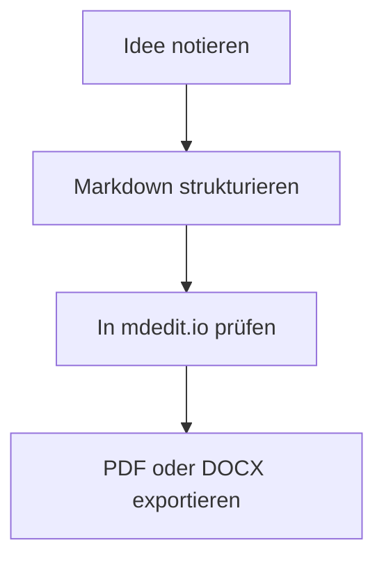
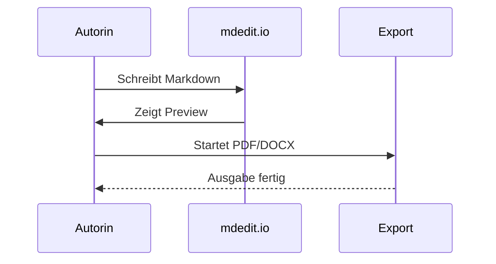

```mdedit-bibliography
[{"URL":"https://daringfireball.net/projects/markdown/","author":[{"family":"Gruber","given":"John"}],"id":"gruber2004markdown","issued":{"date-parts":[[2004]]},"note":"Accessed 2026-05-10","title":"Markdown","type":""},{"URL":"https://commonmark.org/","author":[{"literal":"CommonMark Contributors"}],"id":"commonmark2026","issued":{"date-parts":[[2026]]},"note":"Accessed 2026-05-10","title":"CommonMark","type":""},{"URL":"https://pandoc.org/","author":[{"family":"MacFarlane","given":"John"}],"id":"pandoc2025","issued":{"date-parts":[[2025]]},"note":"Accessed 2026-05-10","title":"Pandoc","type":""},{"author":[{"family":"Hertel","given":"Matthias"}],"id":"mdeditreadme2026","issued":{"date-parts":[[2026]]},"note":"Repository documentation, local source","title":"mdedit.io README","type":""},{"author":[{"family":"Hertel","given":"Matthias"}],"id":"mdedithelp2026","issued":{"date-parts":[[2026]]},"note":"Repository help page, local source","title":"mdedit.io Help Page","type":""},{"author":[{"family":"Hertel","given":"Matthias"}],"id":"mdeditaiapi2026","issued":{"date-parts":[[2026]]},"note":"Repository operations documentation, local source","title":"AI Chat API Dokumentation","type":""},{"author":[{"family":"Hertel","given":"Matthias"}],"id":"mdeditserver2026","issued":{"date-parts":[[2026]]},"note":"Repository implementation in server.js, local source","title":"mdedit.io Scientific Citation and Export Implementation","type":""}]
```

::: title-page
<!-- img: align=center width=44% -->


# Markdown einfach mit mdedit.io {.no-toc}

## Ein Praxisbuch für Schreiben, Layout, Zusammenarbeit und PDF-Export {.no-toc}

**mdedit.io Redaktion**  
Stand 2026-05-10
:::

::: blank-page

# So nutzt du dieses Buch

Dieses Buch ist als tatsächlicher Arbeitsleitfaden gedacht. Es erklärt nicht nur Markdown-Syntax, sondern den gesamten Weg, den mdedit.io heute abbildet: schreiben, strukturieren, Seiten prüfen, gemeinsam überarbeiten und am Ende als PDF oder DOCX ausgeben. Wenn du die Anwendung zum ersten Mal öffnest, soll dich dieses Dokument bis zu einem belastbaren Ergebnis tragen.

**So ist der Lernweg aufgebaut:**

1. Zuerst verstehst du das Dokumentmodell von mdedit.io: ein Markdown-Kern, mehrere Ansichten und ein klarer Exportpfad.
2. Danach lernst du die Syntax und die Erweiterungen, die im Alltag wirklich tragen.
3. Im zweiten Teil kommen Navigation, Seitenansicht, Kollaboration, KI, Layout und wissenschaftliche Sonderfunktionen hinzu.
4. Zum Schluss arbeitest du mit vollständigen Abläufen statt mit Einzeltricks.

**Wenn du nur 30 Minuten hast:** Lies Kapitel 1, Kapitel 2, Kapitel 5 und Kapitel 7. Damit kannst du bereits sauber schreiben, dich im Editor orientieren, ein Dokument teilen und eine erste PDF- oder DOCX-Ausgabe erzeugen.

<!-- page-break -->

# Kapitelplan

1. Kapitel 1 erklärt, wie mdedit.io als Dokumentumgebung funktioniert und warum das für längere Texte wichtig ist.
2. Kapitel 2 zeigt die Syntax, die du sofort produktiv brauchst.
3. Kapitel 3 erweitert das Grundmodell um Strukturmarker, Verzeichnisse, IDs und Querverweise.
4. Kapitel 4 behandelt Formeln, Diagramme, Bilder, Tabellen und Seitenbausteine.
5. Kapitel 5 beschreibt Navigation, Teilen und Kollaboration im heutigen Produktstand.
6. Kapitel 6 bündelt Layout, KI, eingebettete Bibliografie und Export.
7. Kapitel 7 zeigt vollständige Workflows für reale Dokumente.
8. Der Anhang bleibt ein kompaktes Nachschlagewerk im Buchformat.

<!-- page-break -->

::: chapter

# 1. mdedit.io als Dokumentumgebung

**Das lernst du hier:**

- warum mdedit.io nicht nur ein Editor, sondern ein kompletter Dokumentpfad ist,
- wie Editor, Vorschau, Baumansicht, Seitenansicht und KI zusammengehören,
- weshalb Markdown hier das Arbeitsformat und nicht nur ein Eingabeformat ist.

**Mini-Aufgabe:** Öffne in mdedit.io ein neues Dokument und wechsle einmal bewusst zwischen Editor, Vorschau, Baumansicht, Seitenansicht und KI-Panel. Ziel ist noch nicht das Schreiben, sondern das Verständnis der Arbeitsflächen.

mdedit.io ist heute auf ernsthafte Dokumente ausgerichtet: Abschlussarbeiten, technische Spezifikationen, Berichte, Handbücher und Buchmanuskripte. Der Kern bleibt Markdown, aber das Produkt darum herum ist größer geworden. Es gibt eine Sidebar mit Historie und Ordnern, eine rechte Arbeitsfläche mit Vorschau, Baumansicht, Seitenansicht und KI-Chat, einen Layout-Editor für Seiten- und Typografieregeln, einen Share-Pfad für Links und gemeinsame Bearbeitung sowie PDF- und DOCX-Export aus derselben Quelle [@mdeditreadme2026; @mdedithelp2026].

Für Einsteiger ist das ein Vorteil, weil die Anwendung keinen Account erzwingt und trotzdem schon die zentralen Stufen professioneller Dokumentarbeit mitbringt. Du beginnst im Rohtext, kontrollierst Struktur über Überschriften, prüfst den Lesefluss in der Vorschau, kontrollierst Umbrüche in der Seitenansicht und entscheidest erst dann über Freigabe, Kollaboration oder Export. Genau dadurch bleibt der Dokumentkern nachvollziehbar und portabel [@gruber2004markdown; @pandoc2025].

Tabelle 1: Die fünf Arbeitsflächen von mdedit.io und ihre Rolle im Alltag.

::: table{layout=scientific}
| Bereich | Was du dort tust | Wofür er besonders gut ist | Wichtiger Hinweis |
| --- | --- | --- | --- |
| Editor | Markdown direkt schreiben | Schnelles Formulieren und Umstellen | Der Editor ist die Quelle, nicht die Vorschau |
| Vorschau | Gerendertes Dokument lesen | Syntax sofort visuell prüfen | Noch nicht identisch mit der Seitenausgabe |
| Baumansicht | H1 bis H6 als Struktur sehen | Große Dokumente navigieren | Die Baumansicht liest Überschriften, keine verborgene Semantik |
| Seitenansicht | Paged-Preview mit Umbrüchen sehen | Druck- und PDF-nahe Prüfung | Erst hier siehst du Seitenumbrüche realistisch |
| KI-Panel | Mit Dokumentkontext arbeiten | Umformulieren, straffen, umstellen | Fakten- und Quellenverantwortung bleibt bei dir |
:::

### 1.1 Das Grundprinzip in einem Satz

Ein mdedit-Dokument ist ein lesbarer Markdown-Text, der gleichzeitig Vorschau, Seitenlayout, Kollaboration, KI-Bearbeitung und Export speisen kann.

### 1.2 Die vier Presets

mdedit.io bietet vier Preview-Presets: Wissenschaftlich, Kompakt, Literarisch und Dokument. Wissenschaftlich eignet sich für Abschlussarbeiten und Berichte mit ruhigem Satzbild. Kompakt ist für Referenzdokumente und dichte Übersichten nützlich. Literarisch gibt langen Lesetexten mehr Luft. Dokument nutzt Layoutvorgaben direkt aus deinem Markdown und ist damit der präziseste Modus, sobald du dokumentlokale Gestaltungsregeln einsetzt [@mdedithelp2026].

Für dieses Buch ist `preset: literary` gesetzt, weil es wie ein längerer Leitfaden gelesen werden soll. Dasselbe System kann jedoch jederzeit in einen wissenschaftlichen oder kompakteren Modus wechseln, ohne dass du den Text neu schreiben musst.

::: pagebreak

# 2. Die Syntax, die du sofort brauchst

**Das lernst du hier:**

- wie Überschriften und Absätze den Kern eines Dokuments bilden,
- welche Zeichen und Muster im Alltag zuerst zählen,
- wie aus wenigen Bausteinen bereits ein sauberes Manuskript entsteht.

**Mini-Aufgabe:** Erstelle ein Minidokument mit einer H1, zwei H2 und je einem Absatz darunter.

## 2.1 Überschriften und Absätze

Der wichtigste Anfang ist die Kapitelstruktur. Markdown erzeugt Überschriften über führende `#`-Zeichen. Ein Leerabsatz trennt Gedanken voneinander.

```md
# Kapitel
## Unterkapitel
### Abschnitt

Ein neuer Absatz beginnt nach einer Leerzeile.
```

### 2.1.1 Was gute Struktur bedeutet

Gute Markdown-Texte denken von oben nach unten. Zuerst kommt die Gliederung, dann die Ausformulierung. Genau deshalb eignet sich mdedit.io besonders gut für outline-orientiertes Schreiben: Die Baumansicht baut direkt auf deinen Überschriften auf, und jede saubere H1-, H2- oder H3-Struktur zahlt später auf Navigation, Inhaltsverzeichnis und Export ein [@mdedithelp2026; @mdeditreadme2026].

## 2.2 Hervorhebungen, Code und Zitate

Die wichtigsten Zeichen für Betonung sind schnell gelernt.

```md
**fett**
*kursiv*
`inline-code`
> Zitat
```

Im Fließtext sieht das dann so aus: **klar**, *betont*, `präzise`. Ein Blockzitat eignet sich, wenn du eine fremde Aussage, eine Definition oder eine kurze Merkhilfe absetzen willst.

> Markdown ist dort stark, wo Struktur wichtiger ist als ständige Sichtformatierung.

## 2.3 Listen, Links, Bilder und Tabellen

Listen organisieren Argumente, Links verweisen auf Quellen, Bilder verankern Anschauung, Tabellen verdichten Unterschiede.

```md
- Punkt A
- Punkt B

1. Schritt eins
2. Schritt zwei

[mdedit.io](https://md.2b6.de)


| Spalte | Wert |
| --- | --- |
| A | B |
```

- Ungeordnete Listen sind gut für Sammlungen.
- Geordnete Listen sind gut für Abläufe.
- Lange Punkte bleiben auch über mehrere Zeilen lesbar, wenn die Einrückung stimmt.

1. Erst schreiben.
2. Dann strukturieren.
3. Danach exportieren.

<!-- img: align=center width=74% frame -->


Tabelle 2: Die ersten Syntaxbausteine im Alltag.

::: table{layout=compact}
| Baustein | Wofür du ihn brauchst | Merksatz |
| --- | --- | --- |
| `#` | Überschriften | Struktur zuerst |
| `**...**` | Betonung | Nur das Wichtige fett setzen |
| `-` oder `1.` | Listen | Gedanken sauber ordnen |
| `` `...` `` | Code oder Begriffe | Technik deutlich markieren |
| `![...]` | Bilder | Inhalt sichtbar machen |
:::

Die Tabelle ist absichtlich knapp. Einsteiger überschätzen oft den Umfang von Markdown, obwohl die ersten produktiven Dokumente schon mit Überschriften, Absätzen, Listen, Links, Bildern und zwei oder drei Hervorhebungen funktionieren. Alles Weitere kannst du nachziehen, sobald der Text trägt.

<div class="page-break" style="break-before: page; page-break-before: always;"></div>

# 3. Strukturmarker und Erweiterungen

**Das lernst du hier:**

- welche Erweiterungen im Alltag wirklich nützlich sind,
- wie IDs, Querverweise und Verzeichnisse in mdedit.io zusammenspielen,
- wo Zusatzsyntax hilft und wo sie nur Lärm erzeugt.

**Mini-Aufgabe:** Ergänze zu einem bestehenden Absatz genau eine Fußnote, eine Markierung und eine Aufgabenliste mit zwei Punkten.

Standard-Markdown reicht weit. In der Praxis helfen jedoch einige Erweiterungen, damit ein Dokument nicht nur korrekt, sondern auch komfortabel wird.

## 3.1 GFM: Aufgabenlisten, Autolinks und Durchstreichung

```md
- [x] Erledigt
- [ ] Offen

https://example.com

~~veraltet~~
```

- [x] Kapitelstruktur angelegt
- [ ] Export final geprüft

Autolink im Text: https://example.com

Dieses Wort ist ~~veraltet~~ und wird ersetzt.

## 3.2 Fußnoten und Definitionslisten

Fußnoten sind nützlich, wenn ein Zusatz den Lesefluss nicht brechen soll.[^einsteiger]

Begriff Markdown
: Eine leicht lesbare Auszeichnungssprache für strukturierte Texte.

Begriff Preview
: Die gerenderte Sicht auf denselben Markdown-Quelltext.

[^einsteiger]: In mdedit.io eignen sich Fußnoten besonders für Kommentare, Zusatzhinweise und Varianten, solange kein hochspezialisierter note-style-Zitierpfad verlangt wird.

## 3.3 Admonitions, Markierungen und kleine Hilfen

::: warning
Zu viel Formatierung macht auch in Markdown Texte schlechter. Wenn jede zweite Zeile fett, farbig oder eingerahmt ist, verliert die Struktur ihre Ruhe.
:::

::: tip
Merke dir nur fünf Dinge zuerst: Überschriften, Absätze, Listen, Links und Bilder. Der Rest kann später dazukommen.
:::

Inline-Helfer funktionieren ebenfalls:

- Emoji: Ich :heart: klare Dokumente.
- Tiefstellung und Hochstellung: H~2~O und x^2^.
- Markierung: ==Dieser Satz soll beim Überfliegen auffallen==.
- Typografische Anführungszeichen: "gerade" wird zu „typografisch“.

*[API]: Application Programming Interface

Eine Abkürzung wie API kann so im Dokument erläutert werden, ohne dass jeder Satz erneut erklärt werden muss.

## 3.4 IDs, Inhaltsverzeichnis und Querverweise

### Ein Abschnitt mit ID {#anker-abschnitt}

Eine ID ist praktisch, wenn du auf eine Stelle im Dokument verweisen willst oder wenn das Dokument in mdedit.io später mit Querverweisen arbeitet. Für strukturierte Texte ist das besonders nützlich, weil Inhaltsverzeichnis, Abschnittsverweise und wissenschaftliche Referenzen dann nicht nur optisch, sondern semantisch an derselben Gliederung hängen.

```md
### Ein Abschnitt mit ID {#anker-abschnitt}

Ein Absatz mit Klasse {.hinweis}
```

Für längere Dokumente kommen drei Marker besonders häufig vor:

```md
[[toc]]

<!-- list-of-figures -->
<!-- list-of-tables -->
```

`[[toc]]` erzeugt ein Inhaltsverzeichnis. Die Marker für Abbildungs- und Tabellenverzeichnis reservieren den Platz für automatisch erzeugte Listen. Genau deshalb lohnt es sich, Überschriften, Bilder und Tabellen früh sauber zu benennen.

Für interne Abschnittsverweise arbeitet mdedit.io mit typisierten IDs wie `#sec:...` und Verweisen im Text wie `[@sec:methodik]`. Die Vorschau löst diese Verweise zu klickbaren Abschnittsnummern auf, und beim Export bleibt der semantische Pfad erhalten [@mdedithelp2026; @mdeditserver2026].

<!-- page-break -->

# 4. Mathe, Diagramme und anschauliche Elemente

**Das lernst du hier:**

- wie mathematische Formeln im Dokument lesbar bleiben,
- wie Mermaid aus Text Diagramme macht,
- wie Bilder im Satz mehr als bloßer Schmuck werden.

**Mini-Aufgabe:** Ergänze ein Mini-Diagramm oder eine einzelne Formel in ein Testdokument und prüfe sofort die Vorschau.

Markdown wird oft unterschätzt, sobald Mathematik oder Visualisierung ins Spiel kommen. Mit KaTeX und Mermaid trägt mdedit.io diese Fälle jedoch direkt im Dokument.

## 4.1 Formeln mit KaTeX

Inline funktioniert Mathematik mit `$...$`, größere Blöcke mit `$$...$$`.

Inline: $E = mc^2$

$$
\int_0^\infty e^{-x^2} \, dx = \frac{\sqrt{\pi}}{2}
$$

## 4.2 Diagramme mit Mermaid





## 4.3 Bildmarker und Textumfluss

mdedit.io kennt vorangestellte Bildmarker, mit denen du Ausrichtung, Breite und Rahmung direkt im Markdown steuerst.

```md
<!-- img: align=right width=28% shadow -->


```

<!-- img: align=right width=28% shadow -->


Dieser Absatz demonstriert die eigentliche Wirkung: Das Bild sitzt nicht nur unter dem Text, sondern kann als ruhige Seitenfigur mitlaufen. Für Bücher, Handbücher und Berichte ist das interessant, weil Text und visuelle Orientierung enger zusammenrücken. Marker wie `frame`, `shadow` oder `filter=grayscale` helfen dabei, dieselbe Bilddatei je nach Rolle anders einzusetzen.

Ein zweiter Absatz sorgt dafür, dass der Umfluss sichtbar bleibt und danach wieder sauber endet. Gerade in längeren Dokumenten entscheidet diese Kleinarbeit darüber, ob eine Seite nach Handbuch oder nach zusammengewürfelter Exportstrecke aussieht.

## 4.4 Tabellen, Spalten und Seitenbausteine

Markdown allein ist noch kein gutes Buchsatzsystem. mdedit.io ergänzt deshalb Tabellenlayouts, Spalten und explizite Seitenmarker. Für Tabellen kannst du unterschiedliche Layouts wie `scientific` oder `compact` setzen. Für Spickzettel, Gegenüberstellungen oder Anhangsseiten stehen Spaltenblöcke und Umbruchmarker zur Verfügung.

```md
::: table{layout=scientific}
| Feld | Wert |
| --- | --- |
| Stil | ruhig |
:::

::: columns{count=2 gap=18pt rule=true}
Linke Spalte

::: column-break

Rechte Spalte
:::
```

Hinzu kommen Kapitel- und Seitenmarker wie `::: chapter`, `::: pagebreak`, `<!-- page-break -->` oder `<!-- title-page --> ... <!-- /title-page -->`. Sie sind vor allem dann wichtig, wenn du dein Dokument nicht mehr nur lesen, sondern bewusst als Seitenobjekt steuern willst [@mdedithelp2026].

::: section{type=new-page columns=2}
## 4.5 Zweispaltige PDF-Referenzsektion

Die linke Spalte dient als echte Satzprobe. Hier zeigt sich, wie ein neuer Abschnitt mit Seitenwechsel und Zweispalten-Layout im Export wirkt, ohne dass dafür ein separates Dokument gebaut werden muss. Gerade für Anhänge, Marginalien, Spickzettel oder verdichtete Vergleichsseiten ist das relevant.

<!-- column-break -->

Die rechte Spalte prüft denselben Fall mit explizitem Spaltenumbruch. Damit benutzt diese Referenzdatei nicht nur den allgemeinen Spaltencontainer, sondern auch eine Sektionsanweisung, die Seitenwechsel und Mehrspaltigkeit gemeinsam auslöst. Für PDF-Tests ist das ein wertvoller Sonderfall.
:::

::: chapter

# 5. Navigation, Teilen und Kollaboration

**Das lernst du hier:**

- wie du dich in längeren Dokumenten sicher bewegst,
- wie Freigabe und gemeinsame Bearbeitung heute funktionieren,
- welche Produktfunktionen im Alltag den größten Zeitgewinn bringen.

**Mini-Aufgabe:** Lege einen Ordner an, verschiebe zwei Dokumente hinein und öffne danach bewusst das Share-Menü. Ziel ist, die Produktlogik außerhalb des eigentlichen Textes kennenzulernen.

Hier beginnt der Bereich, in dem mdedit.io sich am deutlichsten von einem simplen Markdown-Feld unterscheidet. Für kurze Notizen ist das alles fast schon Luxus. Für längere Texte ist es der Unterschied zwischen einer Datei und einer Arbeitsumgebung.

## 5.1 Sidebar, Historie und Baumansicht

Die Sidebar verwaltet Dokumenthistorie und Ordner. Du kannst Dokumente gruppieren, über die Suche filtern, Ordner umbenennen, exportieren und löschen. Gerade bei Serien von Berichten, Kapiteln oder Varianten spart das spürbar Zeit, weil die Dokumentorganisation nicht außerhalb des Editors ausgelagert werden muss [@mdedithelp2026].

Die Baumansicht sitzt rechts neben der Vorschau. Sie kann die Struktur als Outline oder als Netz visualisieren, arbeitet aber konsequent auf Basis deiner Überschriften H1 bis H6. Das ist eine Stärke und eine Grenze zugleich: Für Kapitelnavigation ist sie hervorragend, sie ersetzt aber keine tiefe Dokumentsemantik für Objekte, die gar nicht über Überschriften modelliert sind [@mdeditreadme2026; @mdedithelp2026].

## 5.2 Share-Menü und Exportpfade

Über das Share-Menü im Editorkopf laufen heute mehrere Wege zusammen: teilbare Links, Kopieren von Markdown oder formatiertem Word-Text, Download als Markdown, DOCX oder PDF sowie ZIP-Export für Ordner oder lokale Daten inklusive Assets. Genau das macht mdedit.io für Review- und Abgabeprozesse interessant: derselbe Dokumentkern kann direkt in verschiedene Ausgabeformen überführt werden [@mdedithelp2026; @mdeditserver2026].

Wichtig ist die Logik der Sichtbarkeit: Dokumente sind nicht einfach automatisch öffentlich. Sie werden erst über den Share-Pfad freigegeben. Das ist für Arbeitsentwürfe sinnvoll, weil private Entstehung und gezieltes Teilen sauber voneinander getrennt bleiben [@mdeditreadme2026].

Tabelle 3: Die wichtigsten Produktfunktionen jenseits des reinen Schreibens.

::: table{layout=scientific}
| Funktion | Was sie heute leistet | Wofür sie in der Praxis wichtig ist |
| --- | --- | --- |
| Historie und Ordner | Dokumente sammeln, gruppieren, filtern | Serien von Texten und Versionen sauber führen |
| Baumansicht | Struktur als Outline oder Netz zeigen | Makrostruktur großer Texte schneller prüfen |
| Share-Menü | Link, Kopieren, Download, ZIP bündeln | Review, Handoff und Archivierung vereinfachen |
| Gemeinsame Bearbeitung | Präsenz und Live-Zusammenarbeit in geteilten Dokumenten | Abstimmung ohne Dateipendel |
| Seitenansicht | drucknahe Paged-Preview zeigen | Exportfehler früher erkennen |
:::

## 5.3 Gemeinsame Bearbeitung

Freigegebene Dokumente können gemeinsam bearbeitet werden. In der Oberfläche sind Präsenz-Indikatoren sichtbar, der Anzeigename für die Zusammenarbeit wird in den Einstellungen gepflegt und für geteilte Dokumente kann ein Passwort gesetzt werden. Die Option `Gemeinsame Bearbeitung erlauben` steuert, ob ein Client sich automatisch an geteilten Dokumenten beteiligt [@mdedithelp2026].

In der Praxis ist wichtig: Teilen und Kollaboration sind zwei zusammenhängende, aber getrennte Schritte. Zuerst entsteht der Link, danach beginnt die gemeinsame Bearbeitung. Für Teams, Betreuungssituationen oder schnelle Review-Runden ist das deutlich klarer als ein unkontrolliertes „alles ist immer live für alle“.

Die Regel für den Alltag lautet: Zuerst das Dokument teilen, dann bewusst gemeinsam bearbeiten. Das hält Besitz, Sichtbarkeit und Verantwortlichkeit sauber getrennt.

::: pagebreak

# 6. Layout, KI, Bibliografie und Export

**Das lernst du hier:**

- wie Layout in mdedit.io zwischen Presets, Layout-Editor und Dokumentblock verteilt ist,
- wie der aktuelle Bibliografiepfad tatsächlich funktioniert,
- wie KI-Bearbeitung und Export heute ineinandergreifen.

**Mini-Aufgabe:** Ergänze in einem Testdokument ein kleines Frontmatter mit `title`, `lang` und `preset`, bevor du weitere Optionen ausprobierst.

## 6.1 Frontmatter und Metadaten

YAML-Frontmatter steht am Anfang eines Dokuments und bündelt Sprache, Titel, Autorenschaft und weitere Dokumentoptionen. In mdedit.io kann Frontmatter außerdem den wissenschaftlichen Pfad, die Referenzsektion oder das Grundpreset eines Dokuments markieren [@mdeditserver2026].

```yaml
---
title: "Mein Dokument"
lang: de-DE
preset: literary
---
```

Für längere oder technischere Dokumente kommen weitere Schlüssel hinzu, etwa `number-sections: true` für Abschnittsnummern oder `reference-section-title` für den Namen des Literaturverzeichnisses. Damit verschiebt sich Layout- und Dokumentlogik von verstreuten Einzeltricks in einen klar sichtbaren Anfangsblock.

## 6.2 Zitationen und eingebettete Bibliografie

Für wissenschaftliche Dokumente unterstützt mdedit.io den eingebetteten Quellenmodus über einen `mdedit-bibliography`-Block. Das ist heute der maßgebliche lokale Dokumentpfad. Zitate bleiben dann datenbasiert im Dokument, statt als manuell formatierte Literaturliste herumzuliegen [@pandoc2025; @mdeditserver2026].

```text
---
citation-source: embedded
reference-section-title: Quellen
link-citations: true
link-bibliography: true
---

Nach [@gruber2004markdown] und [@pandoc2025] ...

~~~bibliography-example
[{"id":"gruber2004markdown", "title":"Markdown", ... }]
~~~

#refs
```

Diese Referenzdatei benutzt den Mechanismus tatsächlich. Deshalb können Aussagen zu Markdown, CommonMark, Pandoc und mdedit.io direkt im Fließtext zitiert werden [@gruber2004markdown; @commonmark2026; @mdeditreadme2026]. Ältere dateibasierte `bibliography:`-Pfade sind für lokale mdedit-Dokumente nicht mehr der vorgesehene Standardworkflow [@mdeditserver2026].

## 6.3 KI-Panel und strukturierte Edit-Aktionen

Das KI-Panel arbeitet in mdedit.io nicht nur als freier Chat, sondern kann auch strukturierte Operationen wie `REPLACE`, `INSERT`, `APPEND`, `PREPEND`, `UPDATE_LAYOUT` oder `ADVICE` anstoßen [@mdeditaiapi2026; @mdeditserver2026]. Für Einsteiger ist das nützlich, wenn ein Kapitel gekürzt, ein Abschnitt umgestellt oder eine Liste sauber zusammengeführt werden soll, ohne dass die Dokumentstruktur verloren geht.

Für Layoutanfragen ist `UPDATE_LAYOUT` besonders wichtig. Wenn du nach breiteren Rändern, einer Kopfzeile, veränderten Spalten oder anderer Typografie fragst, muss nicht der ganze Text neu geschrieben werden; der Assistent kann gezielt den `layout`-Block aktualisieren. Das ist einer der produktivsten Unterschiede zwischen bloßer Textbearbeitung und dokumentnaher KI-Unterstützung.

Zusätzlich verwaltet mdedit.io mehrere Chats pro Dokument. Modelle und API-Zugänge werden in den Einstellungen unter den KI-Modellen geführt, und Änderungen durch die KI lassen sich rückgängig machen [@mdedithelp2026].

::: info
Die beste Rolle von KI in Markdown-Dokumenten ist editorisch: glätten, umstellen, zusammenfassen, Varianten vorschlagen. Die Verantwortung für Fakten, Quellen und Argumente bleibt beim Menschen.
:::

## 6.4 Layout-Editor, Seitenansicht und Export

mdedit.io trennt nicht zwischen Schreiben und spätem Panik-Export. Die normale Vorschau zeigt den Inhalt, die Seitenansicht zeigt die Seite, und der Export überführt denselben Kern in DOCX oder PDF [@mdedithelp2026; @mdeditserver2026]. Für Bücher, Berichte und wissenschaftliche Texte ist das entscheidend, weil Seitenränder, Kapitelstarts, Bildunterschriften und Tabellen nicht erst in letzter Minute sichtbar werden.

Der Layout-Editor ergänzt diesen Weg um eine visuelle Bearbeitung für Seitenränder, Typografie, Tabellen und visuelle Regeln. Wo die Presets nicht reichen, kann ein Dokument zusätzlich einen `layout`-Block tragen. Genau dieser Dreischritt ist heute typisch für mdedit.io: Preset für den schnellen Anfang, Layout-Editor für gezielte Anpassungen, `layout`-Block für dokumentgebundene Feinarbeit.

::: table{layout=reference}
| Layoutoption | Sichtbarer PDF-Effekt |
| --- | --- |
| eigene Caption-Position | Tabellenunterschriften bleiben vom Standard unterscheidbar |
| Zebra-Streifen | dichte Tabellen sind in langen PDFs schneller lesbar |
| feinere Rahmen | Referenzseiten bleiben technisch, aber ruhiger |
:::

<div class="page-break" style="break-before: page; page-break-before: always;"></div>

# 7. Drei belastbare Workflows

**Das lernst du hier:**

- wie mdedit.io in echten Dokumentlagen benutzt wird,
- wann du Struktur, Vorschau, Seitenansicht und Kollaboration in welcher Reihenfolge nutzt,
- wie du vor dem Export einen realistischen Schlusscheck machst.

**Mini-Aufgabe:** Nimm ein vorhandenes Dokument und ordne es einem der drei folgenden Muster zu: Solo-Entwurf, gemeinsames Review oder ausgabeorientiertes Langdokument.

Wer mit mdedit.io arbeitet, braucht weniger Tricks als Reihenfolge. Die drei Muster decken den größten Teil realer Anwendungen ab.

1. **Solo-Entwurf:** Struktur im Editor anlegen, Vorschau parallel lesen, in der Baumansicht auf Makrostruktur prüfen, am Ende als Markdown oder PDF sichern.
2. **Gemeinsames Review:** Dokument freigeben, Link teilen, Anzeigename setzen, gemeinsam arbeiten und für externe Kommentare bei Bedarf als DOCX exportieren.
3. **Langdokument mit Satzanspruch:** Mit Preset starten, Bilder und Tabellen sauber markieren, in der Seitenansicht prüfen, Layout im Editor oder im `layout`-Block verfeinern und zum Schluss PDF und bei Bedarf DOCX erzeugen.

Die zentrale Regel bleibt in allen drei Fällen gleich: erst Struktur, dann Anreicherung, dann Layout, dann Ausgabe. Wer diese Reihenfolge einhält, verhindert die meisten Probleme, bevor sie überhaupt entstehen.

::: warning
Viele Probleme entstehen nicht, weil mdedit.io zu wenig kann, sondern weil zu früh an der Optik geschraubt wird. Wenn die Kapitelstruktur noch nicht trägt, helfen auch Seitenansicht, Schatten und perfekte Tabellenfarben nicht.
:::

Tabelle 4: Schlusscheck für ein längeres mdedit-Dokument.

::: table{layout=compact}
| Frage | Ja/Nein |
| --- | --- |
| Sind alle H1- und H2-Ebenen sinnvoll benannt? | ☐ |
| Ist klar, welches Preset oder welcher Layoutpfad genutzt wird? | ☐ |
| Sind Bilder, Tabellen und Marker korrekt gesetzt? | ☐ |
| Wurde die Seitenansicht vor dem Export geprüft? | ☐ |
| Ist klar, ob Link, DOCX, PDF oder ZIP gebraucht wird? | ☐ |
:::

<!-- page-break -->

# Anhang A. Spickzettel in zwei Spalten

::: columns{count=2 gap=18pt rule=true}
## Die zehn wichtigsten Zeichen

- `#` für Überschriften
- `**...**` für fett
- `*...*` für kursiv
- `` `...` `` für Inline-Code
- `-` und `1.` für Listen
- `[Text](URL)` für Links
- `` für Bilder
- `| ... |` für Tabellen
- `> ...` für Zitate
- `[^1]` für Fußnoten

::: column-break

## Die wichtigsten mdedit-Sonderfunktionen

- `[[toc]]` für Inhaltsverzeichnis
- `<!-- list-of-figures -->` für Abbildungen
- `<!-- list-of-tables -->` für Tabellen
- `<!-- title-page --> ... <!-- /title-page -->` für Coverseiten
- `::: chapter` für Kapitelstart
- `::: pagebreak` für Seitenumbruch
- `::: blank-page` für leere Zwischenseiten
- `::: columns{...}` für Spalten
- `<!-- img: ... -->` für Bildlayout
- `::: table{layout=...}` für Tabellenstil
- ` ```layout ` für dokumentlokale Seitengestaltung
- `mdedit-bibliography` plus `#refs` für Quellen
:::

## Anhang B. Aktive Referenzstellen

Wie in Abbildung 1 und Abbildung 2 sichtbar wird, eignet sich dieses Dokument nicht nur als Lehrtext, sondern auch als aktuelle Layout- und Produktprobe. Die gespiegelten Ränder, die große Covergrafik, das echte Titelblatt, die Leerseite, gemischte Kapitel- und Umbruchmarker, die zweispaltige Sektionsprobe, der Umfluss, die Tabellenlayouts, die bibliografische Einbettung und die Kombination aus Buchsatz- und Produktfunktionen sind absichtlich gemeinsam gesetzt, damit diese Referenzdatei sowohl didaktisch als auch technisch belastbar bleibt.

#refs

```layout
page:
  mirrorMargins: true
  bindingOffset: 4mm
  size: A4
  orientation: portrait
  margins:
    top: 2.6cm
    right: 2.2cm
    bottom: 2.4cm
    left: 3cm
    firstPageTop: 4.4cm
titlePage:
  enabled: true
  pageBreakAfter: true
columns:
  enabled: false
  count: 2
  gap: 18pt
  rule:
    enabled: true
    width: 0.75pt
    color: '#d6cfbf'
header:
  enabled: true
  hideOnFirstPage: true
  left: Markdown einfach
  center: '{title}'
  right: mdedit.io
  fontSize: 8.5pt
  color: '#4b5563'
  offset: 7mm
footer:
  enabled: true
  hideOnFirstPage: true
  left: literarisches Referenzdokument
  center: '{page}'
  right: 2026-05-10
  fontSize: 9pt
  color: '#6b7280'
  offset: 7mm
indexes:
  tableOfContents:
    enabled: true
    title: Inhalt
    depth: 2
    pageBreakAfter: true
  listOfFigures:
    enabled: true
    title: Abbildungen
    pageBreakAfter: true
  listOfTables:
    enabled: true
    title: Tabellen
    pageBreakAfter: true
numbering:
  enabled: true
  resetPerChapter: false
  headings:
    enabled: false
    depth: 2
typography:
  body:
    fontFamily: Georgia, "Times New Roman", serif
    fontSize: 10.8pt
    lineHeight: 1.48
    textAlign: justify
    hyphenation: true
    paragraph:
      firstLineIndent: 14pt
      spacing: 0pt
  headings:
    color: '#1f1a17'
    h1:
      size: 28pt
      marginBottom: 18pt
      weight: 700
    h2:
      size: 18pt
      marginTop: 20pt
      marginBottom: 10pt
      weight: 650
    h3:
      size: 13pt
      marginTop: 12pt
      marginBottom: 6pt
  code:
    inline: 9.4pt
    block:
      fontSize: 8.8pt
      lineHeight: 1.38
      background: '#efe7da'
      border: '#d5cab8'
  links:
    color: '#2f4f6f'
    showUrls: true
  blockquote:
    color: '#5a554f'
    borderColor: '#d8cfbf'
images:
  maxWidth: 100%
  alignment: center
  margin:
    top: 16pt
    bottom: 18pt
  caption:
    enabled: true
    position: bottom
    fontSize: 8.8pt
    fontStyle: italic
    color: '#61584f'
    marginTop: 6pt
spacing:
  paragraph: 12pt
  list: 16pt
  listIndent: 1.5em
  blockquote: 18pt
  codeBlock: 12pt
  formula: 18pt
lists:
  unordered:
    marker: •
    indent: 1.5em
  ordered:
    style: decimal
    format: '{number}.'
tableLayouts:
  default:
    fontSize: 9.8pt
    cellPadding: 7pt
    border:
      width: 0.5pt
      color: '#d8cfbf'
  compact:
    fontSize: 9.2pt
    border:
      width: 0.5pt
      color: '#dad2c3'
  reference:
    fontSize: 9.4pt
    cellPadding: 5pt 7pt
    border:
      width: 0.5pt
      color: '#cdbda5'
    margin:
      top: 14pt
      bottom: 14pt
    header:
      background: '#f3eadc'
      textColor: '#2d261f'
      fontWeight: 600
      textAlign: left
      repeatOnPages: true
    body:
      textAlign: left
      zebraStriping: true
      evenRowBackground: '#fffdfa'
      oddRowBackground: '#f7f1e8'
    caption:
      enabled: true
      position: top
      fontSize: 8.4pt
      fontStyle: normal
      color: '#52473b'
      marginTop: 0
      marginBottom: 5pt
```
