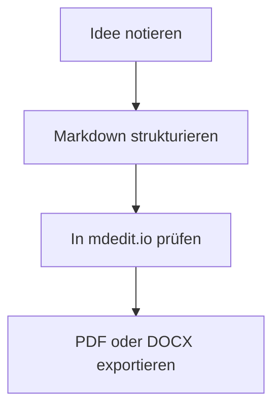
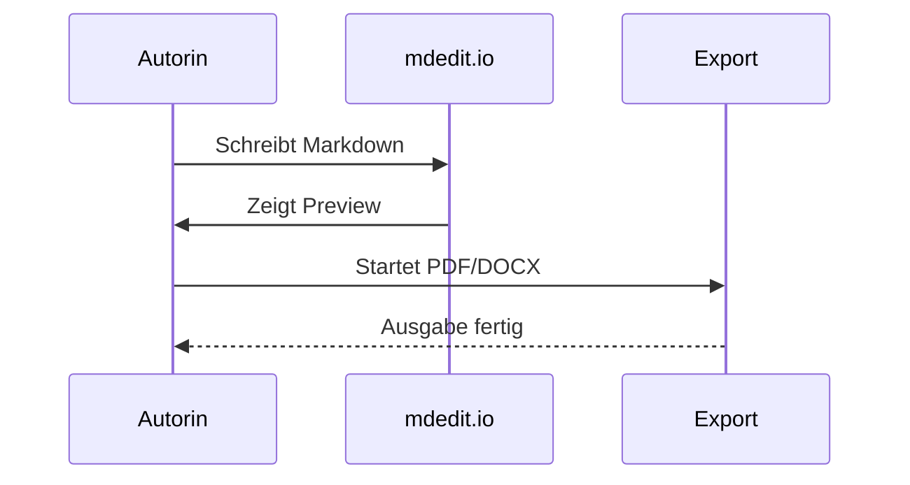

```mdedit-bibliography
[{"URL":"https://daringfireball.net/projects/markdown/","author":[{"family":"Gruber","given":"John"}],"id":"gruber2004markdown","issued":{"date-parts":[[2004]]},"note":"Accessed 2026-05-10","title":"Markdown","type":""},{"URL":"https://commonmark.org/","author":[{"literal":"CommonMark Contributors"}],"id":"commonmark2026","issued":{"date-parts":[[2026]]},"note":"Accessed 2026-05-10","title":"CommonMark","type":""},{"URL":"https://pandoc.org/","author":[{"family":"MacFarlane","given":"John"}],"id":"pandoc2025","issued":{"date-parts":[[2025]]},"note":"Accessed 2026-05-10","title":"Pandoc","type":""},{"author":[{"family":"Hertel","given":"Matthias"}],"id":"mdeditreadme2026","issued":{"date-parts":[[2026]]},"note":"Repository documentation, local source","title":"mdedit.io README","type":""},{"author":[{"family":"Hertel","given":"Matthias"}],"id":"mdedithelp2026","issued":{"date-parts":[[2026]]},"note":"Repository help page, local source","title":"mdedit.io Help Page","type":""},{"author":[{"family":"Hertel","given":"Matthias"}],"id":"mdeditaiapi2026","issued":{"date-parts":[[2026]]},"note":"Repository operations documentation, local source","title":"AI Chat API Dokumentation","type":""},{"author":[{"family":"Hertel","given":"Matthias"}],"id":"mdeditserver2026","issued":{"date-parts":[[2026]]},"note":"Repository implementation in server.js, local source","title":"mdedit.io Scientific Citation and Export Implementation","type":""}]
```

<!-- img: align=center width=44% -->


*Ein visueller Schnellstart für Struktur, Export und mdedit-Sonderfunktionen.*

<div class="page-break" style="break-before: page; page-break-before: always;"></div>

# So nutzt du dieses Buch

Dieses Buch ist nicht als reine Referenzwand gebaut, sondern als Lernpfad. Du kannst es linear lesen oder gezielt in das Kapitel springen, das du gerade brauchst. Die Grundidee bleibt immer gleich: erst Struktur, dann Ausdruck, dann Ausgabe.

**So ist der Lernweg aufgebaut:**

1. Du lernst zuerst die Syntax, die du sofort produktiv macht.
2. Danach kommen die Erweiterungen, die Dokumente angenehmer und präziser machen.
3. Anschließend folgen mdedit-spezifische Werkzeuge für Layout, Vorschau, Quellen und Export.

**Wenn du nur 30 Minuten hast:** Lies Kapitel 1, Kapitel 2 und Kapitel 7. Damit kannst du bereits sauber schreiben, ordentlich gliedern und sinnvoll exportieren.

<div class="page-break" style="break-before: page; page-break-before: always;"></div>

# Kapitelplan

1. Kapitel 1 erklärt, warum Markdown gerade für Einsteiger praktisch ist.
2. Kapitel 2 zeigt die Basissyntax: Überschriften, Absätze, Hervorhebungen, Listen, Links, Bilder und Tabellen.
3. Kapitel 3 führt GFM, Fußnoten, Definitionslisten, Markierungen und Admonitions ein.
4. Kapitel 4 behandelt Formeln, Diagramme und bildhafte Elemente.
5. Kapitel 5 zeigt die wichtigsten mdedit-Werkzeuge jenseits von Standard-Markdown.
6. Kapitel 6 deckt wissenschaftliche Sonderfunktionen, Quellen und KI-Unterstützung ab.
7. Kapitel 7 bündelt alles in einem einfachen Arbeitsablauf.
8. Der Anhang gibt dir einen kompakten Spickzettel.

<div class="page-break" style="break-before: page; page-break-before: always;"></div>

# 1. Warum Markdown für Anfänger sinnvoll ist

**Das lernst du hier:**

- warum Markdown weniger nach Formatstress und mehr nach Denken in Struktur funktioniert,
- weshalb mdedit.io den Einstieg erleichtert,
- wie du dieses Buch pragmatisch statt perfekt nutzt.

**Mini-Aufgabe:** Notiere drei Überschriften zu einem Thema, das du gut kennst, ohne an Schriftgrößen oder Formatvorlagen zu denken.

Markdown ist zuerst einmal eine Schreiboberfläche für Gedanken. Statt Schriften, Einzüge und Menüleisten zu verwalten, markierst du nur die Struktur: Überschriften, Listen, Hervorhebungen, Bilder, Tabellen. Der Text bleibt als Rohtext lesbar, kann aber gleichzeitig in HTML, DOCX oder PDF überführt werden [@gruber2004markdown; @pandoc2025].

Für Einsteiger ist genau das der eigentliche Gewinn. Du schreibst zunächst in einer Form, die leicht zu verstehen und leicht zu korrigieren ist. Erst später entscheidest du, wie das Dokument aussehen soll. In mdedit.io kommt hinzu, dass dieser Rohtext nicht am Ende einer Kette steht, sondern das Zentrum des ganzen Workflows bildet: Vorschau, Outline, KI-Panel, Layout-Editor und Export arbeiten alle auf demselben Dokumentkern [@mdedithelp2026; @mdeditaiapi2026].

Tabelle 1: Drei Schreiblogiken im schnellen Vergleich.

::: table{layout=scientific}
| Ansatz | Was du bearbeitest | Stärke für Einsteiger | Typische Hürde |
| --- | --- | --- | --- |
| WYSIWYG | Sichtformatierung | Sofort sichtbare Optik | Formatdrift in langen Dokumenten |
| Markdown | Strukturierter Rohtext | Klare Syntax, leicht kopierbar | Anfangs neue Denkweise |
| mdedit.io | Markdown plus Layout- und Exportwerkzeuge | Ein Dokument für Schreiben, Vorschau und Ausgabe | Man muss die Sonderfunktionen kennen |
:::

### 1.1 Die Grundidee in einem Satz

Wenn du `# Kapitel`, `- Liste` und `**wichtig**` lesen kannst, kannst du mit Markdown schon produktiv schreiben.

### 1.2 Was mdedit.io gegenüber einfachem Markdown ergänzt

mdedit.io erweitert das Basismodell um Dokumentlayout, Druckvorschau, strukturierte Bilder, Tabellenlayouts, Spalten, Kapitelmarker, wissenschaftliche Quellenpfade und KI-gestützte Bearbeitungen. Dadurch wird Markdown von einer leichten Notationssprache zu einer belastbaren Produktionsumgebung für Handbücher, Berichte und längere Arbeiten [@mdeditreadme2026; @mdeditserver2026].

::: info
Dieses Buch imitiert nicht die Marke einer bekannten Einsteigerreihe. Es übernimmt nur deren didaktische Idee: kurze Kapitel, direkte Sprache, viele Beispiele und eine klare Lernkurve.
:::

<div class="page-break" style="break-before: page; page-break-before: always;"></div>

# 2. Die Syntax, die du sofort brauchst

**Das lernst du hier:**

- wie Überschriften und Absätze den Kern eines Dokuments bilden,
- welche fünf Zeichen du wirklich zuerst behalten solltest,
- wie aus ein paar einfachen Mustern schon ein belastbarer Text entsteht.

**Mini-Aufgabe:** Erstelle ein Minidokument mit einer H1, zwei H2 und je einem Absatz darunter.

## 2.1 Überschriften und Absätze

Der wichtigste Anfang ist die Kapitelstruktur. Markdown erzeugt Überschriften über führende `#`-Zeichen. Ein Leerabsatz trennt Gedanken voneinander.

```md
# Kapitel
## Unterkapitel
### Abschnitt

Ein neuer Absatz beginnt nach einer Leerzeile.
```

### 2.1.1 Was gute Struktur bedeutet

Gute Markdown-Texte denken von oben nach unten. Zuerst kommt die Gliederung, dann die Details. Genau deshalb eignet sich Markdown besonders gut für Outline-orientiertes Schreiben: Du erkennst sofort, was Hauptkapitel ist, was Unterpunkt und was nur eine Randnotiz.

## 2.2 Hervorhebungen, Code und Zitate

Die wichtigsten Zeichen für Betonung sind schnell gelernt.

```md
**fett**
*kursiv*
`inline-code`
> Zitat
```

Im Fließtext sieht das dann so aus: **klar**, *betont*, `präzise`. Ein Blockzitat eignet sich, wenn du eine fremde Aussage, eine Definition oder eine kurze Merkhilfe absetzen willst.

> Markdown ist dort stark, wo Struktur wichtiger ist als ständige Sichtformatierung.

## 2.3 Listen, Links, Bilder und Tabellen

Listen organisieren Argumente, Links verweisen auf Quellen, Bilder verankern Anschauung, Tabellen verdichten Unterschiede.

```md
- Punkt A
- Punkt B

1. Schritt eins
2. Schritt zwei

[mdedit.io](https://md.2b6.de)


| Spalte | Wert |
| --- | --- |
| A | B |
```

- Ungeordnete Listen sind gut für Sammlungen.
- Geordnete Listen sind gut für Abläufe.
- Lange Punkte bleiben auch über mehrere Zeilen lesbar, wenn die Einrückung stimmt.

1. Erst schreiben.
2. Dann strukturieren.
3. Danach exportieren.

<!-- img: align=center width=74% frame -->


Tabelle 2: Die ersten Syntaxbausteine im Alltag.

::: table{layout=compact}
| Baustein | Wofür du ihn brauchst | Merksatz |
| --- | --- | --- |
| `#` | Überschriften | Struktur zuerst |
| `**...**` | Betonung | Nur das Wichtige fett setzen |
| `-` oder `1.` | Listen | Gedanken sauber ordnen |
| `` `...` `` | Code oder Begriffe | Technik deutlich markieren |
| `![...]` | Bilder | Inhalt sichtbar machen |
:::

<div class="page-break" style="break-before: page; page-break-before: always;"></div>

# 3. Erweiterungen, die aus Rohtext ein gutes Dokument machen

**Das lernst du hier:**

- welche Erweiterungen im Alltag wirklich nützlich sind,
- wie Zusatzsyntax den Lesefluss verbessert,
- wo du bewusst sparsam bleiben solltest.

**Mini-Aufgabe:** Ergänze zu einem bestehenden Absatz genau eine Fußnote, eine Markierung und eine Aufgabenliste mit zwei Punkten.

Standard-Markdown reicht weit. In der Praxis helfen jedoch einige Erweiterungen, damit ein Dokument nicht nur korrekt, sondern auch komfortabel wird.

## 3.1 GFM: Aufgabenlisten, Autolinks und Durchstreichung

```md
- [x] Erledigt
- [ ] Offen

https://example.com

~~veraltet~~
```

- [x] Kapitelstruktur angelegt
- [ ] Export final geprüft

Autolink im Text: https://example.com

Dieses Wort ist ~~veraltet~~ und wird ersetzt.

## 3.2 Fußnoten und Definitionslisten

Fußnoten sind nützlich, wenn ein Zusatz den Lesefluss nicht brechen soll.[^einsteiger]

Begriff Markdown
: Eine leicht lesbare Auszeichnungssprache für strukturierte Texte.

Begriff Preview
: Die gerenderte Sicht auf denselben Markdown-Quelltext.

[^einsteiger]: In mdedit.io eignen sich Fußnoten besonders für Kommentare, Zusatzhinweise und Varianten, solange kein hochspezialisierter note-style-Zitierpfad verlangt wird.

## 3.3 Admonitions, Markierungen und kleine Hilfen

::: warning
Zu viel Formatierung macht auch in Markdown Texte schlechter. Wenn jede zweite Zeile fett, farbig oder eingerahmt ist, verliert die Struktur ihre Ruhe.
:::

::: tip
Merke dir nur fünf Dinge zuerst: Überschriften, Absätze, Listen, Links und Bilder. Der Rest kann später dazukommen.
:::

Inline-Helfer funktionieren ebenfalls:

- Emoji: Ich :heart: klare Dokumente.
- Tiefstellung und Hochstellung: H~2~O und x^2^.
- Markierung: ==Dieser Satz soll beim Überfliegen auffallen==.
- Typografische Anführungszeichen: "gerade" wird zu „typografisch“.

*[API]: Application Programming Interface

Eine Abkürzung wie API kann so im Dokument erläutert werden, ohne dass jeder Satz erneut erklärt werden muss.

## 3.4 Attribute und sprechende Anker

### Ein Abschnitt mit ID {#anker-abschnitt}

Eine ID ist praktisch, wenn du zu einer Stelle verlinken oder sie in einer langen Diskussion eindeutig benennen willst. Klassen und Attribute sind keine Pflicht für Einsteiger, aber hilfreich, sobald Dokumente gezielt gestaltet oder automatisiert weiterverarbeitet werden.

```md
### Ein Abschnitt mit ID {#anker-abschnitt}

Ein Absatz mit Klasse {.hinweis}
```

<div class="page-break" style="break-before: page; page-break-before: always;"></div>

# 4. Mathe, Diagramme und anschauliche Elemente

**Das lernst du hier:**

- wie mathematische Formeln im Dokument lesbar bleiben,
- wie Mermaid aus Text Diagramme macht,
- wie Bilder im Satz mehr als bloßer Schmuck werden.

**Mini-Aufgabe:** Ergänze ein Mini-Diagramm oder eine einzelne Formel in ein Testdokument und prüfe sofort die Vorschau.

Markdown wird oft unterschätzt, sobald Mathematik oder Visualisierung ins Spiel kommen. Mit KaTeX und Mermaid trägt mdedit.io diese Fälle jedoch direkt im Dokument.

## 4.1 Formeln mit KaTeX

Inline funktioniert Mathematik mit `$...$`, größere Blöcke mit `$$...$$`.

Inline: $E = mc^2$

$$
\int_0^\infty e^{-x^2} \, dx = \frac{\sqrt{\pi}}{2}
$$

## 4.2 Diagramme mit Mermaid





## 4.3 Bildmarker und Textumfluss

mdedit.io kennt vorangestellte Bildmarker, mit denen du Ausrichtung, Breite und Rahmung direkt im Markdown steuerst.

```md
<!-- img: align=right width=28% shadow -->


```

<!-- img: align=right width=28% shadow -->


Dieser Absatz demonstriert die eigentliche Wirkung: Das Bild sitzt nicht nur unter dem Text, sondern kann als ruhige Seitenfigur mitlaufen. Für buchartige Dokumente ist das interessant, weil Text und visuelle Orientierung enger zusammenrücken. Marker wie `frame`, `shadow` oder `filter=grayscale` helfen dabei, dieselbe Bilddatei je nach Rolle anders einzusetzen.

Ein zweiter Absatz sorgt dafür, dass der Umfluss sichtbar bleibt und danach wieder sauber endet. Gerade in längeren Dokumenten entscheidet diese Kleinarbeit darüber, ob eine Seite nach Handbuch oder nach zusammengewürfelter Exportstrecke aussieht.

<div class="page-break" style="break-before: page; page-break-before: always;"></div>

# 5. Was mdedit.io über Markdown hinaus kann

**Das lernst du hier:**

- welche Werkzeuge mdedit.io zusätzlich zum Markdown-Kern anbietet,
- wie Inhaltsnavigation, Layout und Vorschau zusammenarbeiten,
- welche Funktionen du erst später, aber dann sehr bewusst einsetzen solltest.

**Mini-Aufgabe:** Öffne in mdedit.io einmal bewusst den Layout-Editor und die Paged Preview, auch wenn du noch nichts verändern willst. Ziel ist nur, den Weg zu kennen.

Hier beginnt der Bereich, in dem aus Syntax ein Dokumentsystem wird. Nicht alles davon braucht man am ersten Tag, aber wer längere Texte schreibt, spart damit sehr schnell Zeit.

## 5.1 Inhaltsverzeichnis, Abbildungs- und Tabellenlisten

Das Inhaltsverzeichnis wird mit `[[toc]]` erzeugt. Listen für Abbildungen und Tabellen entstehen über spezielle Platzhalter.

```md
[[toc]]

<!-- list-of-figures -->
<!-- list-of-tables -->
```

Für Bücher, Leitfäden und Abschlussarbeiten ist das mehr als Komfort. Es zwingt zu einer sauberen Struktur und macht schnell sichtbar, ob das Dokument tatsächlich als Ganzes lesbar ist.

## 5.2 Kapitel- und Seitenmarker

Kapitel können mit `::: chapter` oder `<!-- chapter -->` explizit auf eine neue Seite gelegt werden. Reine Seitenwechsel funktionieren über `::: pagebreak` oder `<!-- page-break -->`. Eine gestaltete Titelseite lässt sich mit `<!-- title-page --> ... <!-- /title-page -->` markieren; eine bewusst leere Zwischenseite ist über `::: blank-page` oder `<!-- blank-page -->` vorgesehen.

```md
::: chapter
# Neues Kapitel

::: pagebreak
```

Für diese Lernfassung werden Kapitelauftakte bewusst robust über explizite Seitenumbrüche getrennt. Die eigentlichen Kapitelmarker sind trotzdem wichtig, weil sie in mdedit.io die dramaturgische Gliederung größerer Dokumente unterstützen.

## 5.3 Tabellenlayouts und Dokumentlokale Steuerung

Für Tabellen gibt es nicht nur Markdown-Syntax, sondern auch Layoutmarker. So kann dieselbe Tabelle bewusst wissenschaftlich, kompakt oder neutral gesetzt werden.

```md
::: table{layout=scientific}
| Feld | Wert |
| --- | --- |
| Stil | ruhig |
:::
```

Tabelle 3: Dokumentfunktionen von mdedit.io für längere Texte.

::: table{layout=scientific}
| Funktion | Nutzen im Alltag | Warum sie für Bücher hilft |
| --- | --- | --- |
| Outline / Tree | Kapitel schnell verschieben | Makrostruktur bleibt sichtbar |
| Layout-Editor | Ränder, Typografie, Tabellen anpassen | Satzbild wird früh kontrollierbar |
| Paged Preview | Seiten realistisch prüfen | Überraschungen vor dem Export sinken |
| DOCX/PDF-Export | verschiedene Zielpfade | Ein Dokument, mehrere Ausgaben |
| KI-Panel | textnahe Überarbeitung | Struktur bleibt am Markdown-Kern |
:::

## 5.4 Spalten, Abschnittsumbrüche und Seitendramaturgie

Spaltenbereiche eignen sich für Spickzettel, Gegenüberstellungen oder Randwissen. mdedit.io unterstützt dafür dokumentnahe Marker.

```md
::: columns{count=2 gap=18pt rule=true}
Linke Spalte

::: column-break

Rechte Spalte
:::
```

Auch Abschnittsumbrüche lassen sich markieren:

```md
::: section{type=new-page columns=2}
```

Die Regel für Einsteiger lautet trotzdem: Erst normal schreiben, dann nur dort in Spalten oder Sonderabschnitte wechseln, wo es einen echten Leservorteil gibt.

<div class="page-break" style="break-before: page; page-break-before: always;"></div>

# 6. Wissenschaftliche und produktive Sonderfunktionen

**Das lernst du hier:**

- wie Frontmatter und Quellenpfade arbeiten,
- warum mdedit.io für wissenschaftliche Dokumente mehr kann als nur Markdown rendern,
- wie KI-Unterstützung sinnvoll und kontrolliert eingesetzt wird.

**Mini-Aufgabe:** Ergänze in einem Testdokument ein kleines Frontmatter mit `title`, `lang` und `preset`, bevor du weitere Optionen ausprobierst.

## 6.1 Frontmatter und Metadaten

YAML-Frontmatter steht am Anfang eines Dokuments und bündelt Sprache, Titel, Autorenschaft und weitere Dokumentoptionen. In mdedit.io kann Frontmatter außerdem den wissenschaftlichen Pfad, die Referenzsektion oder das Grundpreset eines Dokuments markieren [@mdeditserver2026].

```yaml
---
title: "Mein Dokument"
lang: de-DE
preset: literary
---
```

## 6.2 Zitationen und eingebettete Bibliografie

Für wissenschaftliche Dokumente unterstützt mdedit.io den eingebetteten Quellenmodus über einen `mdedit-bibliography`-Block. Zitate bleiben dann datenbasiert im Dokument, statt als manuell formatierte Literaturliste herumzuliegen [@pandoc2025; @mdeditserver2026].

```text
[@gruber2004markdown]

~~~bibliography-example
[{"id":"gruber2004markdown", ... }]
~~~

#refs
```

Diese Referenzdatei benutzt den Mechanismus tatsächlich. Deshalb können Aussagen zu Markdown, CommonMark, Pandoc und mdedit.io direkt im Fließtext zitiert werden [@gruber2004markdown; @commonmark2026; @mdeditreadme2026].

## 6.3 KI-Panel und strukturierte Edit-Aktionen

Das KI-Panel arbeitet in mdedit.io nicht nur als freier Chat, sondern kann auch strukturierte Operationen wie `REPLACE`, `INSERT`, `APPEND`, `PREPEND` oder `ADVICE` anstoßen [@mdeditaiapi2026]. Für Einsteiger ist das nützlich, wenn ein Kapitel gekürzt, ein Abschnitt umgestellt oder eine Liste sauber zusammengeführt werden soll, ohne dass die Dokumentstruktur verloren geht.

::: info
Die beste Rolle von KI in Markdown-Dokumenten ist editorisch: glätten, umstellen, zusammenfassen, Varianten vorschlagen. Die Verantwortung für Fakten, Quellen und Argumente bleibt beim Menschen.
:::

## 6.4 Vorschau, Paged Preview und Export

mdedit.io trennt nicht zwischen Schreiben und spätem Panik-Export. Die normale Vorschau zeigt den Inhalt, die Paged Preview zeigt die Seite, und der Export überführt denselben Kern in DOCX oder PDF [@mdedithelp2026; @mdeditserver2026]. Für Bücher und Handbücher ist das entscheidend, weil Seitenränder, Kapitelstarts, Bildunterschriften und Tabellen nicht erst in letzter Minute sichtbar werden.

<div class="page-break" style="break-before: page; page-break-before: always;"></div>

# 7. Ein kompletter Anfänger-Workflow

**Das lernst du hier:**

- wie du aus allen vorherigen Kapiteln einen einfachen Arbeitsablauf baust,
- wann du schreiben, wann du strukturieren und wann du gestalten solltest,
- wie du vor dem Export einen realistischen Schnellcheck machst.

**Mini-Aufgabe:** Nimm ein vorhandenes Notizdokument und bringe es in fünf Schritten in eine exportfähige Form.

Wer mit Markdown anfängt, braucht keinen Perfektionismus, sondern Reihenfolge. Der folgende Ablauf ist robust genug für Handbücher, Projektberichte und erste wissenschaftsnahe Texte.

1. Zuerst die Kapitelstruktur anlegen.
2. Dann jeden Abschnitt in groben Sätzen füllen.
3. Listen, Tabellen und Bilder erst dann ergänzen, wenn die Gedankenfolge steht.
4. Erst danach Layout, Kapitelstarts und Exportwege nachziehen.
5. Zum Schluss mit Preview, Paged Preview und Export prüfen.

::: warning
Viele Probleme entstehen nicht, weil Markdown zu wenig kann, sondern weil Autorinnen und Autoren zu früh am Layout schrauben. Wenn die Struktur noch nicht trägt, hilft auch der schönste Satzspiegel nicht.
:::

Tabelle 4: Schlusscheck für ein erstes längeres Markdown-Projekt.

::: table{layout=compact}
| Frage | Ja/Nein |
| --- | --- |
| Sind alle H1- und H2-Ebenen sinnvoll benannt? | ☐ |
| Gibt es nur dort Formatierung, wo sie semantisch hilft? | ☐ |
| Sind Bilder beschriftet und korrekt platziert? | ☐ |
| Wurde die Seitenansicht vor dem Export geprüft? | ☐ |
| Ist klar, ob DOCX, PDF oder beides gebraucht wird? | ☐ |
:::

<div class="page-break" style="break-before: page; page-break-before: always;"></div>

# Anhang A. Spickzettel in zwei Spalten

::: columns{count=2 gap=18pt rule=true}
## Die zehn wichtigsten Zeichen

- `#` für Überschriften
- `**...**` für fett
- `*...*` für kursiv
- `` `...` `` für Inline-Code
- `-` und `1.` für Listen
- `[Text](URL)` für Links
- `` für Bilder
- `| ... |` für Tabellen
- `> ...` für Zitate
- `[^1]` für Fußnoten

::: column-break

## Die wichtigsten mdedit-Sonderfunktionen

- `[[toc]]` für Inhaltsverzeichnis
- `<!-- list-of-figures -->` für Abbildungen
- `<!-- list-of-tables -->` für Tabellen
- `<!-- title-page --> ... <!-- /title-page -->` für Coverseiten
- `::: chapter` für Kapitelstart
- `::: pagebreak` für Seitenumbruch
- `::: blank-page` für leere Zwischenseiten
- `::: columns{...}` für Spalten
- `<!-- img: ... -->` für Bildlayout
- `::: table{layout=...}` für Tabellenstil
- ` ```layout ` für dokumentlokale Seitengestaltung
- `mdedit-bibliography` plus `#refs` für Quellen
:::

## Anhang B. Aktive Referenzstellen

Wie in Abbildung 1 und Abbildung 2 sichtbar wird, eignet sich dieses Dokument nicht nur als Lehrtext, sondern auch als Layoutprobe. Die gespiegelten Ränder, die große Covergrafik, die klar getrennten Kapitelauftakte, der Umfluss und die wissenschaftlichen Metadaten sind absichtlich kombiniert, damit das Referenzbuch sowohl didaktisch als auch gestalterisch belastbar bleibt.

#refs

```layout
page:
  mirrorMargins: true
  bindingOffset: 4mm
  margins:
    top: 2.6cm
    right: 2.2cm
    bottom: 2.4cm
    left: 3cm
    firstPageTop: 4.4cm
header:
  enabled: true
  hideOnFirstPage: true
  left: Markdown einfach
  right: mdedit.io
  fontSize: 8.5pt
  color: '#4b5563'
footer:
  enabled: true
  hideOnFirstPage: true
  center: '{page}'
  fontSize: 9pt
  color: '#6b7280'
indexes:
  tableOfContents:
    depth: 2
typography:
  body:
    paragraph:
      firstLineIndent: 14pt
      spacing: 0pt
  headings:
    h1:
      size: 28pt
      marginBottom: 18pt
    h2:
      size: 18pt
      marginTop: 20pt
      marginBottom: 10pt
images:
  caption:
    fontSize: 8.8pt
    marginTop: 6pt
tableLayouts:
  default:
    border:
      width: 0.5pt
      color: '#d8cfbf'
  compact:
    border:
      width: 0.5pt
      color: '#dad2c3'
```
