# Beispiel: Alle unterstützten Markdown-Erweiterungen

## GFM (Tabellen, Aufgabenlisten, Autolinks, Durchstreichung)

- [x] Aufgabe erledigt
- [ ] Aufgabe offen

Autolink: https://example.com

Durchstreichung: ~~veraltet~~

| Spalte A | Spalte B |
| --- | --- |
| 1 | 2 |
| 3 | 4 |

## Mermaid (Diagramme)

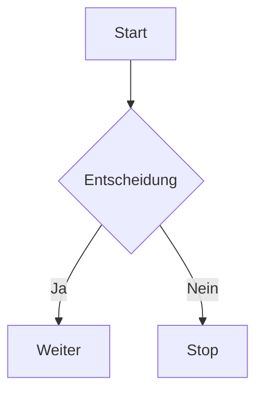

## Mermaid (komplexes Gesamtbeispiel)

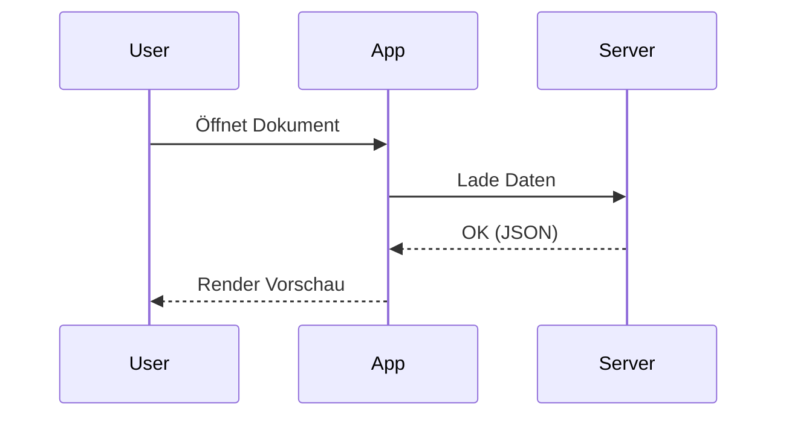

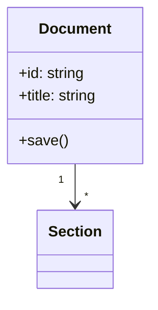

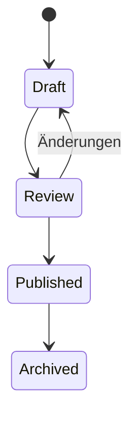

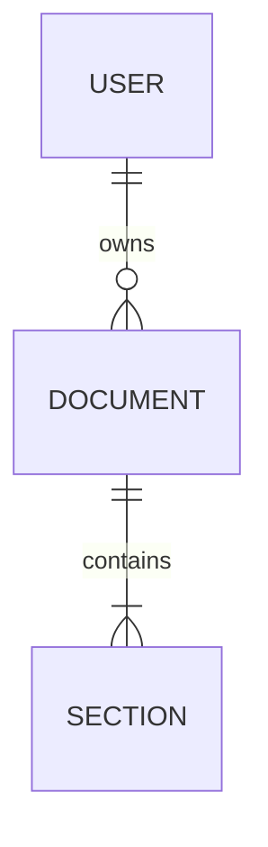

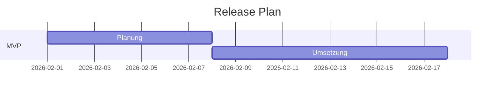

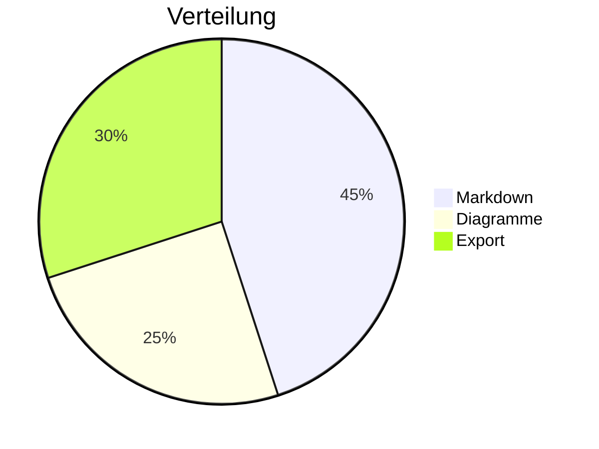

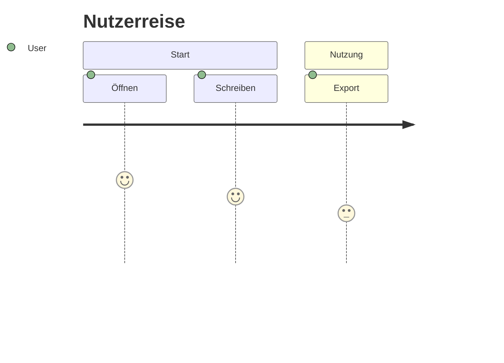

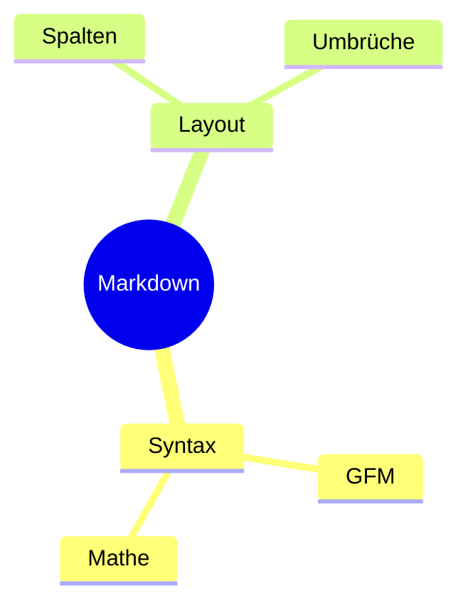

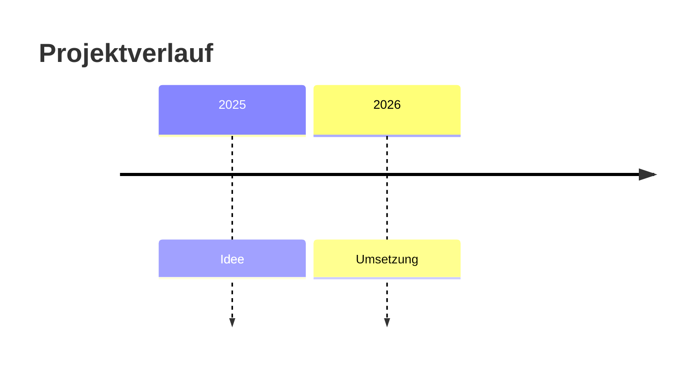

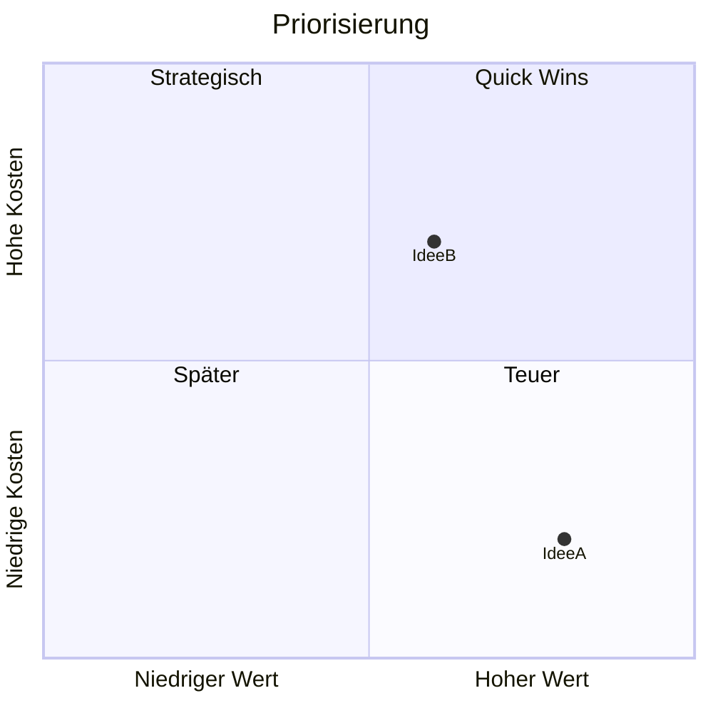

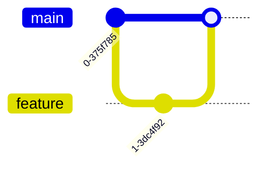

```mermaid
flowchart LR
  %% EPK (Ereignisgesteuerte Prozesskette)
  E0((Bedarf erkannt)) --> F1[Anfrage erstellen]
  F1 --> E1((Anfrage liegt vor))
  E1 --> G1{XOR}
  G1 --> F2[Prüfung automatisiert]
  G1 --> F3[Prüfung manuell]
  F2 --> E2((Prüfung ok))
  F3 --> E2
  E2 --> G2{AND}
  G2 --> F4[Bestellung auslösen]
  G2 --> F5[Lieferant informieren]
  F4 --> E3((Bestellung gesendet))
  F5 --> E4((Lieferant informiert))
  E3 --> G3{AND}
  E4 --> G3
  G3 --> F6[Wareneingang prüfen]
  F6 --> E5((Ware geprüft))
  E5 --> G4{XOR}
  G4 --> F7[Rechnung freigeben]
  G4 --> F8[Reklamation erfassen]
  F7 --> E6((Rechnung freigegeben))
  F8 --> E7((Reklamation erfasst))
  E6 --> F9[Zahlung ausführen]
  F9 --> E8((Zahlung erfolgt))
  E7 --> F10[Lieferant kontaktieren]
  F10 --> E9((Klärung gestartet))

## KaTeX/MathJax (Formeln)

Inline: $E=mc^2$

Block:

$$
\int_0^\infty e^{-x^2} \, dx = \frac{\sqrt{\pi}}{2}
$$

## Fußnoten

Dies ist ein Satz mit Fußnote.[^1]

[^1]: Das ist die Fußnote.

## Definition Lists

Begriff A
: Eine kurze Definition.

Begriff B
: Noch eine Definition.

## Admonitions (Hinweis/Info/Warning)

::: info
Das ist ein Info-Hinweis.
:::

::: warning
Das ist eine Warnung.
:::

::: tip
Das ist ein Hinweis/Tipp.
:::

## Emoji

Ich :heart: Markdown :rocket:

## Subscript / Superscript

H~2~O und x^2^

## Mark/Highlight

==Wichtiger Text==

## Abkürzungen

*[HTML]: HyperText Markup Language

HTML ist eine Auszeichnungssprache.

## Inhaltsverzeichnis (TOC)

[[toc]]

## Attribute (IDs/Klassen)

### Überschrift {#meine-id}

Ein Absatz mit Klasse {.highlight}

## Typografische Anführungszeichen

"Gerade" werden zu „typografisch“

## Layout: Spalten

::: columns
::: column
Spalte 1
:::

::: column
Spalte 2
:::
:::

## Layout: Umbrüche

Zeilenumbruch:

::: linebreak
:::

Spaltenumbruch:

::: columnbreak
:::

Abschnittsumbruch:

::: sectionbreak
:::

Seitenumbruch:

::: pagebreak
:::
