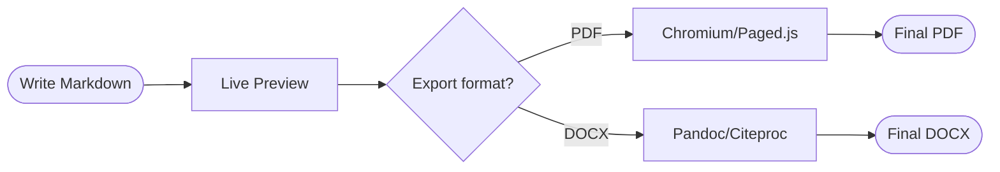

# mdedit.io Feature Showcase

**mdedit.io** is a browser-based Markdown editor for serious documents — theses, papers, reports, books. No account required. Open source. Self-hostable.

This document demonstrates every major feature by writing *about* the product itself. Export it as PDF to see mdedit.io in action.

[[toc]]

<!-- page-break -->

# 1 The Editor

mdedit.io opens instantly in your browser. No signup, no installation, no cloud account. Your documents are stored in the editor's local session and can be exported, shared, or synced at any time.

## 1.1 What you see

:::: columns
::: column
**Left — Sidebar**

The sidebar shows your document history and folders. Documents can be dragged, renamed, grouped into folders, and exported as ZIP. Use the search field to filter large histories.
:::
::: column
**Right — Panels**

Three right-hand panels share a single tab bar: **Preview**, **Outline**, and **AI**. Switch with a click or a keyboard shortcut. The preview updates live as you type.
:::
::::

## 1.2 Keyboard shortcuts

| Action | Shortcut |
|:---|:---|
| Toggle AI panel | `Alt+Space` / `Ctrl+Space` |
| Bold | `Ctrl+B` |
| Italic | `Ctrl+I` |
| Export PDF | Share menu -> Download PDF |
| Next document | `Ctrl+→` |
| Previous document | `Ctrl+←` |
| Toggle sidebar | sidebar pin button |

## 1.3 Layout presets

Switch the preview rendering between four presets:

Scientific
: Wide margins, justified text, floating figures, citation support. Designed for academic papers and theses.

Compact
: Tight line spacing, grid tables, dense lists. Ideal for reference sheets, reports, and handbooks.

Literary
: Generous line height, slightly wider body font, chapter-style headings. For books and long-form prose.

Document
: Uses the `layout` code fence from the Markdown source. Gives you full typographic control per document.

<!-- page-break -->

# 2 Markdown Syntax

## 2.1 Standard elements

mdedit.io renders standard CommonMark/GFM Markdown. All typical elements are supported.

*Italic*, **bold**, ~~strikethrough~~, `inline code`, and ==highlighted text== all render correctly.

> mdedit.io is not a note-taking app. It is a production environment for documents that need to look right when exported.
>
> — mdedit.io project description

## 2.2 Task lists

Release checklist for every deploy:

- [x] i18n validation passes
- [x] Production audit clean
- [x] Citation smoke test passes
- [x] Visual smoke test passes
- [ ] Paged preview parity test (in progress)
- [ ] Layout unit tests in release gate

## 2.3 Tables with MultiMarkdown

mdedit.io supports MultiMarkdown table extensions: multi-line cells, row spans, header-less tables, and column alignment.

| Feature | Status | Notes |
|:---|:---:|:---|
| Live preview | ✓ | Updates on every keystroke |
| PDF export | ✓ | Via Puppeteer/Chromium |
| DOCX export | ✓ | Via Pandoc |
| Collaboration | ✓ | With presence indicators |
| AI assistant | ✓ | Multi-model, multi-chat |
| Offline mode | — | Requires server connection |

## 2.4 Extended syntax

Beyond standard Markdown, mdedit.io adds:

Footnotes
: Use `[^1]` in text and `[^1]: note` at the end.[^fn-example]

Definition lists
: This section shows them. Term on one line, `: Definition` below.

Abbreviations
: Define with `*[abbr]: expansion` anywhere in the document. The abbr renders the tooltip automatically.

Subscript and superscript
: H~2~O is water. E=mc^2^ is physics.

Emoji
: Use short codes: :rocket: :books: :white_check_mark:

[^fn-example]: This is a footnote rendered by mdedit.io. It appears in the footer area on export.

<!-- page-break -->

# 3 Scientific Features

## 3.1 Math with KaTeX

mdedit.io renders mathematical formulas using KaTeX — both inline and as display blocks.

Inline formula: the energy-mass equivalence is $E = mc^2$, where $m$ is mass and $c$ is the speed of light.

The normal distribution probability density:

$$
f(x) = \frac{1}{\sigma\sqrt{2\pi}}\, e^{-\frac{1}{2}\left(\frac{x-\mu}{\sigma}\right)^2}
$$

The quadratic formula for roots of $ax^2 + bx + c = 0$:

$$
x = \frac{-b \pm \sqrt{b^2 - 4ac}}{2a}
$$

## 3.2 Citations and bibliography

In Document or Scientific mode, add a YAML frontmatter block with `bibliography` and `csl` fields. mdedit.io uses Citeproc via Pandoc to render in-text citations and a full bibliography on export.

```yaml
---
title: My Paper
author: A. Author
bibliography: refs.bib
csl: apa.csl
---
```

Cite in text with `[@key]` or `@key`. The bibliography is placed automatically at the end of the document in the configured citation style.

## 3.3 Admonitions

::: info
**Tip:** In Scientific preset, images inside a `figure` container float beside the text. Captions are rendered automatically from the alt text.
:::

::: warning
**Export note:** Use the paged preview (Page view) to inspect page breaks before generating a PDF. What you see in paged preview is what Chromium renders.
:::

::: tip
**Collaboration:** Share a document link and edit together in real time. Presence indicators show who is active. Protect with a password if needed.
:::

# 4 Mermaid Diagrams

mdedit.io renders Mermaid diagrams directly from fenced code blocks. A visual editor with properties panel and zoom is available for diagram editing.

## 4.1 Document pipeline



## 4.2 Supported diagram types

mdedit.io supports Mermaid flowcharts, sequence diagrams, state diagrams, class diagrams, ER diagrams, Gantt charts, mindmaps, and timelines. For compact references, one rendered Mermaid example is enough to validate the diagram pipeline without wasting page height.

<!-- page-break -->

# 5 Layout Control

The `layout` code fence lets you define typographic settings per document, without touching any CSS. Settings cascade from the global preset.

~~~markdown
```layout
page: A4
margin: [25mm, 20mm, 25mm, 20mm]
font-size: 11pt
line-height: 1.5
columns: 1
header: "My Report | {date}"
footer: "{title} | {page}"
table-style: grid
figure-style: float
```
~~~

## 5.1 Columns

Text can flow in two columns using the `columns` container:

:::: columns
::: column
**Left column content.** The `columns` container wraps two or more `column` sections. Column width is equal by default.
:::
::: column
**Right column content.** Useful for sidebars, comparison text, or reference material. Works in all layout presets.
:::
::::

## 5.2 Page and section breaks

Insert explicit breaks for print control:

```markdown
<!-- page-break -->
<!-- section-break -->
<!-- column-break -->
```

These are invisible in screen preview but control Paged.js rendering during PDF export.

## 5.3 Paged preview

The **Page view** panel renders the document as paginated pages using Paged.js before PDF generation. Headers, footers, page numbers, margins, and breaks all appear exactly as they will in the exported PDF.

<!-- page-break -->

# 6 Collaboration and Sharing

## 6.1 Sharing

The share menu in the editor header provides:

- **Permalink**: a shareable link to this exact document
- **Copy Markdown**: the raw source to the clipboard
- **Copy formatted text**: rendered text for pasting into Word or email
- **Download Markdown / DOCX / PDF**: direct file downloads
- **Export ZIP**: the entire folder or all local data including assets

## 6.2 Real-time collaboration

Click the share button and enable **Allow shared editing**. mdedit.io shows presence indicators for all active participants. Set a display name in settings. Optionally protect the session with a password.

# 7 AI Assistant

The AI panel opens beside the preview with `Alt+Space`. It has access to the current document and supports:

- Drafting, rewriting, and summarizing sections
- Answering questions about the document content
- Generating Mermaid diagrams from a description
- Explaining KaTeX expressions
- Multiple parallel chat sessions per document
- Undo: AI-applied changes can be reverted

Configure models in **Settings → AI Models**. Multiple providers are supported simultaneously.

# 8 Self-Hosting

mdedit.io is open source (Apache 2.0) and designed to run on your own infrastructure.

```yaml
# docker-compose.yml (simplified)
services:
  mdedit:
    image: ghcr.io/matthiashertel21/mdedit:latest
    ports:
      - "3000:3000"
    environment:
      BASE_URL: https://your-domain.example.com
    volumes:
      - ./data:/app/data
```

All data stays in your `./data` volume. No external services required. PDF export uses Puppeteer inside the container; DOCX export uses Pandoc.

---

*This document is generated with mdedit.io and demonstrates all major features. Export it as PDF to see the result.*

*Source: [docs/examples/quickread-reference-en.md](https://github.com/MatthiasHertel21/mdedit/blob/main/docs/examples/quickread-reference-en.md) — Apache 2.0*